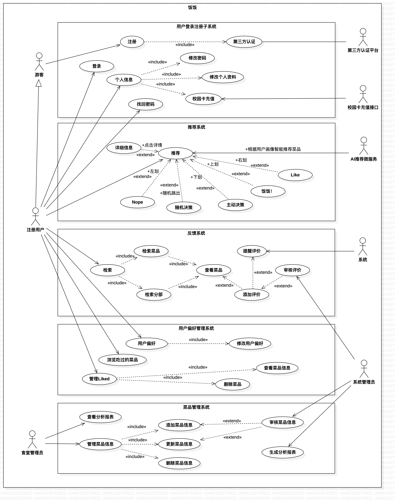
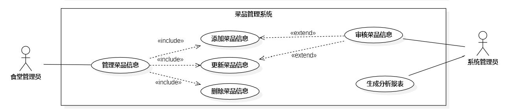

# 饭饭需求规约（说明书）

## 1.背景及产品介绍

一日三餐是我们生活中的刚需，而作为大学生，大多数都会选择在食堂或校园外卖解决日常就餐问题，而食堂为了丰富学生的就餐选择，建设制定了多种菜品和就餐方案，外卖的个人商户也是丰富多样，但同时也会带来学生就餐选择上的烦恼。
本项目旨在提供一个校园专属的餐饮平台，为学生们校园日常生活中的饮食选择提供更加个性化、更有价值的参考与建议。解决大部分同学日常就餐时选择困难的问题，同时也提供同学们相互交流讨论的渠道，进而反馈至相关餐饮服务人员对餐品的质量及时调整，优化校园餐饮环境，刺激良性竞争。
本项目的服务范围分为普通用户、商户和管理员。商户们添加各自的服务菜品作为本项目的核心对象，以此为普通用户推荐本餐菜品时本项目的核心功能，用户可以在个人界面提前填写一些个人信息和口味偏好预设推荐参数，进而影响个性化推荐结果。同时也提供反馈交流系统，普通用户对品尝过的菜品进行公开的评价反馈，为其他用户提供参考，也反馈至商户用于菜品改进。

## 2.整体描述

## 3.系统与其它系统的接口

## 4.需求调研

我们通过 **[问卷形式](https://www.wjx.cn/vm/rpP7alZ.aspx)** 调研了目前同济大学嘉定校区在校生对于校内及学校附近就餐选择的需求，其中主要有三个问题亟待解决：

1. 绝大多数同学存在就餐选择困难

2. 部分同学在食堂的就餐体验不尽如人意

我们发现，超过70%的同学在食堂就餐的频率很高，但却有接近半数的同学对食堂菜品的评价并不好，这说明部分经常在食堂就餐的同学并不能很好的满足自己的口味需求。

3. 大多数同学有尝鲜需求但并没有付诸行动

可以看到，绝大多数同学习惯于根据个人经验进行就餐选择，遇到一个好吃的之后会经常吃这个，但他们中的大多数对于这种方式的评价很一般，我们可以推测，这部分同学有着尝鲜新品的需求，但单纯通过碰运气、参考网络评价的方式也并不能很好的满足自己的口味需求。

同时我们也可以推测：在食堂拥有近百种菜品提供的情况下，第二个问题中仍有近半数同学无法在食堂很好的满足自己的口味需求，他们与本问题中有尝鲜需求但并没有付诸行动的人群或许有着高度重合

## 5.功能性需求描述

### 5.1.总用例图

### 5.2.用户登录注册系统

在用户登录注册系统中，主要应当完成以下功能需求：

1. 游客能够通过学号与密码登录成用户身份。
2. 游客能够通过学号、填写个人信息后完成校园信息认证并注册成为注册用户。
3. 对于食堂管理员及系统管理员账号，也能通过用户名和密码进行登录。

#### 5.2.1 注册用例需求规约

| 用例名称   | 注册   |
| ---------- | ------ |
| 用例编号   | UC0201 |
| 用例说明   |        |
| 执行角色   |        |
| 前置条件   |        |
| 基本事件流 |        |
| 扩展事件流 |        |
| 后置事件流 |        |

#### 5.2.2 登录用例需求规约

| 用例名称   | 登录   |
| ---------- | ------ |
| 用例编号   | UC0202 |
| 用例说明   |        |
| 执行角色   |        |
| 前置条件   |        |
| 基本事件流 |        |
| 扩展事件流 |        |
| 后置事件流 |        |

#### 5.2.3 修改个人资料用例需求规约

| 用例名称   | 修改个人资料 |
| ---------- | ------------ |
| 用例编号   | UC0203       |
| 用例说明   |              |
| 执行角色   |              |
| 前置条件   |              |
| 基本事件流 |              |
| 扩展事件流 |              |
| 后置事件流 |              |

#### 5.2.4 修改密码用例需求规约

| 用例名称   | 修改密码 |
| ---------- | -------- |
| 用例编号   | UC0204   |
| 用例说明   |          |
| 执行角色   |          |
| 前置条件   |          |
| 基本事件流 |          |
| 扩展事件流 |          |
| 后置事件流 |          |

#### 5.2.5 找回密码用例需求规约

| 用例名称   | 找回密码 |
| ---------- | -------- |
| 用例编号   | UC0205   |
| 用例说明   |          |
| 执行角色   |          |
| 前置条件   |          |
| 基本事件流 |          |
| 扩展事件流 |          |
| 后置事件流 |          |

#### 5.2.6 校园卡充值用例需求规约

| 用例名称   | 校园卡充值 |
| ---------- | ---------- |
| 用例编号   | UC0206     |
| 用例说明   |            |
| 执行角色   |            |
| 前置条件   |            |
| 基本事件流 |            |
| 扩展事件流 |            |
| 后置事件流 |            |

### 5.3.推荐系统

### 5.4.反馈系统

### 5.5.用户偏好系统

### 5.6.菜品管理系统

菜品管理系统主要完成的需求是用于管理核心对象——菜品的数据，主要由食堂管理员和系统管理员对数据的增删改查以及审核。

#### 5.6.1 添加菜品信息用例需求规约

<table>
    <tr>
        <td><b>用例编号</b></td>
        <td>UC0501</td>
    </tr>
    <tr>
        <td><b>用例名称</b></td>
        <td>添加菜品信息</td>
    </tr>
    <tr>
        <td><b>用例说明</b></td>
        <td>食堂管理员添加食堂的菜品信息</td>
    </tr>
    <tr>
        <td><b>执行角色</b></td>
        <td>食堂管理员</td>
    </tr>
    <tr>
        <td><b>前置条件</b></td>
        <td>食堂管理员点击添加菜品按钮</td>
    </tr>
    <tr>
        <td><b>基本事件流</b></td>
        <td>
         1. 食堂管理员点击添加菜品，进入菜品信息编辑界面
         2. 食堂管理员以此填写新菜品的信息
         3. 食堂管理员填写完毕后，确认添加新菜品
         4. 系统将菜品信息录入待审核菜品列表
        </td>
    </tr>
    <tr>
        <td><b>扩展事件流</b></td>
        <td></td>
    </tr>
    <tr>
        <td><b>后置条件</b></td>
        <td>食堂管理员成功填写新菜品信息，等待系统管理员审核后反馈结果</td>
    </tr>
</table>

#### 5.6.2 更新菜品信息用例需求规约

#### 5.6.3 删除菜品信息用例需求规约

#### 5.6.4 审核菜品信息用例需求规约

#### 5.6.5 生成分析报表用例需求规约（商户也应该查看）

## 6.非功能性需求描述

## 7.其他需求
