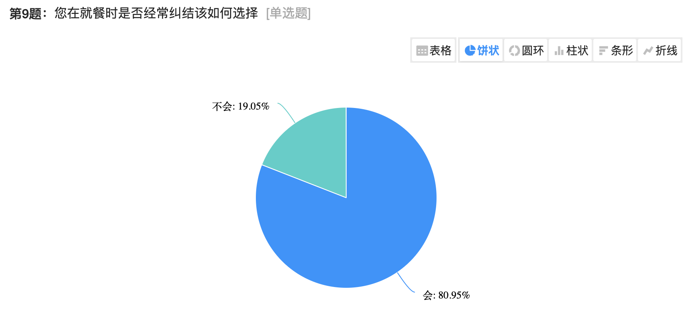
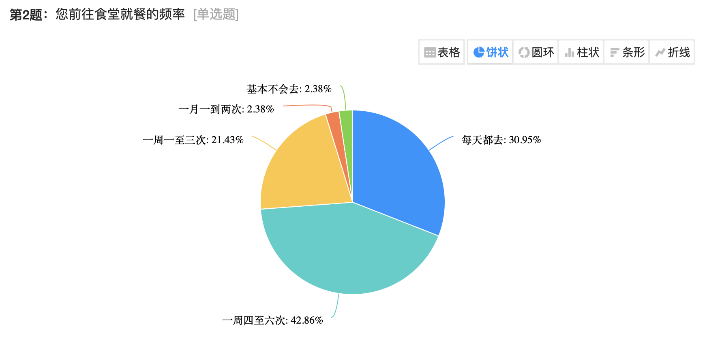
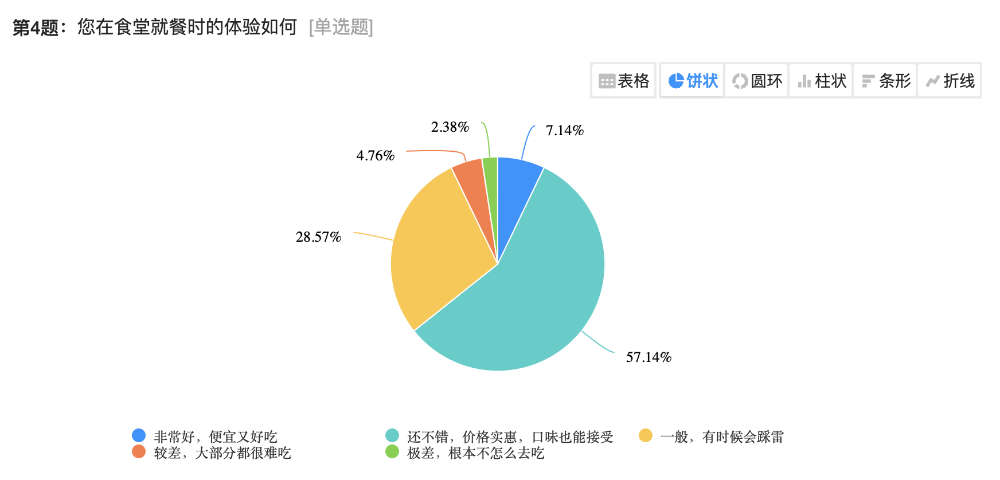
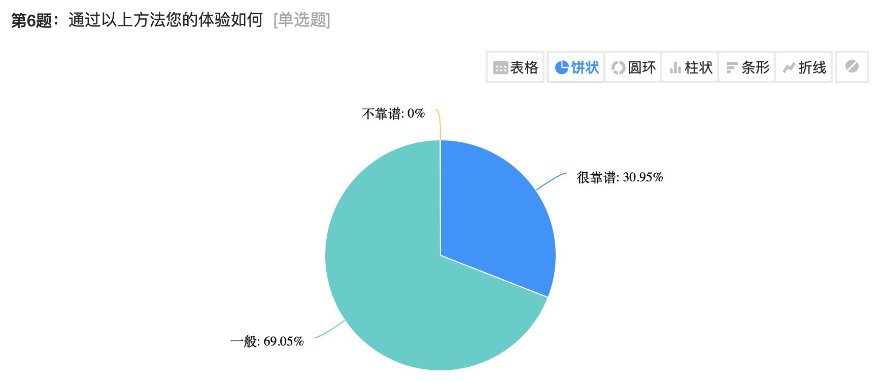

# 饭饭

## 项目背景

## 需求分析

我们通过 **[问卷形式](https://www.wjx.cn/vm/rpP7alZ.aspx)** 调研了目前同济大学嘉定校区在校生对于校内及学校附近就餐选择的需求，其中主要有三个问题亟待解决：

1. 绝大多数同学存在就餐选择困难

2. 部分同学在食堂的就餐体验不尽如人意

我们发现，超过70%的同学在食堂就餐的频率很高，但却有接近半数的同学对食堂菜品的评价并不好，这说明部分经常在食堂就餐的同学并不能很好的满足自己的口味需求。

3. 大多数同学有尝鲜需求但并没有付诸行动

可以看到，绝大多数同学习惯于根据个人经验进行就餐选择，遇到一个好吃的之后会经常吃这个，但他们中的大多数对于这种方式的评价很一般，我们可以推测，这部分同学有着尝鲜新品的需求，但单纯通过碰运气、参考网络评价的方式也并不能很好的满足自己的口味需求。

同时我们也可以推测：在食堂拥有近百种菜品提供的情况下，第二个问题中仍有近半数同学无法在食堂很好的满足自己的口味需求，他们与本问题中有尝鲜需求但并没有付诸行动的人群或许有着高度重合

## 项目功能

- 用户登录注册子系统
  - 注册
  - 登录
  - 修改及找回密码
  - 认证商户身份

- 推荐系统
  - 个性化推荐菜品
  - Like菜品
  - Nope菜品
  - 决策菜品
    - 主动决策
    - 随机决策

- 反馈系统
  - 检索商家
  - 检索菜品
  - 添加评价

- 用户信息管理系统
  - 修改用户信息
  - 管理收藏的菜品信息

- 菜品管理系统
  - 管理商户所有的菜品信息

## 用例分析

