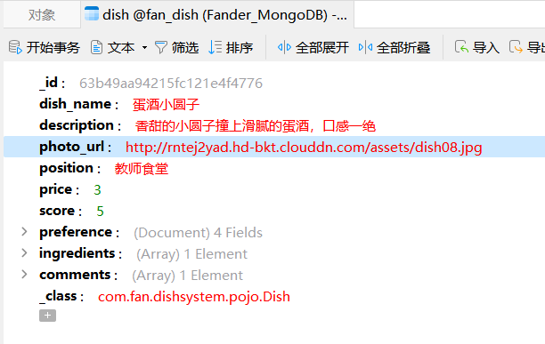
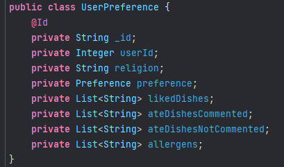

# 概要设计规约文档

修订历史记录

| 编写日期 | SEPG | 版本 | 说明 | 作者 | 备注 |
|-|-|-|-|-|-|
| 2022.12.15 | 饭饭团队 | v1.0 | 初版概要设计 | 夏佳幸 | 无 |
| 2022.12.23 | 饭饭团队 | v2.0 | 补充模块 | 饭饭团队 | 无 |
| 2023.1.02 | 饭饭团队 | v3.0 | 修改 | 饭饭团队 | 无 |

[TOC]

## 1.引言

### 1.1. 概要设计依据

a. 概要设计基本原则
b．饭饭-需求（分析）规约

### 1.2. 参考资料

1.   vantUI官网开发者文档

2.   nut-UI官网开发者文档

3.   《Design Patterns》
4.   mongoDB开发者文档

### 1.3. 假定和约束

本项目开发主要受软件工程课程以及疫情的约束，因此本项目的假定和约束如下所示：

1. 项目开发期限为2个月，时间为2022年11月底至2023年1月初；
2. 项目开发无经费，设备条件为3台Windows操作系统电脑和1台Mac操作系统电脑以及云服务器、图床等；
3. 项目通过问卷调研的方式获取用户数据，并据此我们制定了用户画像；
4. 团队交流方面通过Github、Youtrack等进行代码协作以及团队任务管理。

## 2. 概要设计

### 2.1. 系统总体架构设计 

### 2.2. 系统软件结构设计

对2.1中的系统总体架构设计图中的软件功能部分进行软件系统结构设计（或称软件体系结构设计）。

### 2.3. 接口设计

#### 2.3.1 用户信息管理微服务

##### GetAll

方法签名：public ResponseEntity\<Response> getAll()

接口调用：public Response getAll()

实际调用方法：UserServiceImpl.getAll()

##### GetUser

方法签名：public ResponseEntity\<Response> getUser(Integer userId)

接口调用：public Response getUser(Integer userId)

实际调用方法：UserServiceImpl.getUser(Integer userId)

##### SetUser

方法签名：public ResponseEntity\<Response> setUser(Integer userId, String filter, String param)

接口调用：

public Response setUserName(Integer userId, String newUserName)

public Response setUserAvatar(Integer userId, String avatar)

public Response setUserInstitute(Integer userId, String institute)

public Response setUserGrade(Integer userId, String grade)

实际调用方法：

UserServiceImpl.setUserName

UserServiceImpl.setUserAvatar

UserServiceImpl.setUserInstitute

UserServiceImpl.setUserGrade

##### DeleteUser

方法签名：public ResponseEntity\<Response> deleteUser(Integer userId)

接口调用：public Response deleteUser(Integer userId)

实际调用方法：UserServiceImpl.deleteUser

#### 2.3.2 用户登录注册微服务

##### Login

方法签名：public ResponseEntity\<Response> login(Map<String, Object> form, String filter)

接口调用：

public Response loginByUserName(String userName, String password)

public Response loginByStudentId(Integer studentId, String password)

实际调用方法：

UserServiceImpl.loginByUserName

UserServiceImpl.loginByStudentId

UserServiceImpl.getResponse

UserServiceImpl.getToken

##### Register

方法签名：public ResponseEntity\<Response> register(Map<String, Object> form)

接口调用：public Response register(String userName, Integer studentId, String password)

实际调用方法：

UserServiceImpl.register

UserServiceImpl.getResponse

UserServiceImpl.getToken

##### SetPassword

方法签名：public ResponseEntity\<Response> setPassword(Integer userId, Map<String, Object> form)

接口调用：public Response setPassword(Integer userId, String newPassword)

实际调用方法：UserServiceImpl.setPassword

#### 2.3.3 菜品信息管理微服务

##### GetDishes

方法签名：public ResponseEntity\<Response> getDishes(String filter, String value)

接口调用：

public Response getAll()

public Response getDishesByName(String dishName)

public Response getDishesByPosition(String position)

实际调用方法：

DishServiceImpl.getAll

DishServiceImpl.getDishesByName

DishServiceImpl.getDishesByPosition

##### GetDish

方法签名：public ResponseEntity\<Response> getDish(String dishId)

接口调用：public Response getDishById(String dishId)

实际调用方法：DishServiceImpl.getDishById

##### AddDish

方法签名：public ResponseEntity\<Response> addDish(Map<String, Object> form)

接口调用：public Response addDish(String dishName, String description, String photoUrl, String position, Double price, Map<String, Object> preferenceMap, List\<String> ingredients)

实际调用方法：DishServiceImpl.addDish

##### SetDish

方法签名：public ResponseEntity\<Response> setDish(String dishId, String filter, String value)

接口调用：

public Response setDishName(String dishId, String dishName)

public Response setDishDescription(String dishId, String description)

public Response setDishPhotoUrl(String dishId, String photoUrl)

public Response setDishPosition(String dishId, String position)

public Response setDishPreference(String dishId, Map<String, Object> preferenceMap)

public Response setDishIngredients(String dishId, List\<String> ingredients)

实际调用方法：

DishServiceImpl.setDishName

DishServiceImpl.setDishDescription

DishServiceImpl.setDishPhotoUrl

DishServiceImpl.setDishPosition

DishServiceImpl.setDishPreference

DishServiceImpl.setDishIngredients

##### DeleteDish

方法签名：public ResponseEntity\<Response> deleteDish(String dishId)

接口调用：public Response deleteDish(String dishId)

实际调用方法：DishServiceImpl.deleteDish

##### GetAll

方法签名：public ResponseEntity\<Response> getAll()

接口调用：public Response getAll()

实际调用方法：CommentServiceImpl.getAll

##### GetCommentById

方法签名：public ResponseEntity\<Response> getComment(String commentId)

接口调用：public Response getCommentById(String commentId)

实际调用方法：CommentServiceImpl.getCommentById

##### SetComment

方法签名：public ResponseEntity\<Response> setComment(String commentId, String filter, String value)

接口调用：

public Response setCommentByContext(String commentId, String context)

public Response setCommentByScore(String commentId, Double score)

实际调用方法：

CommentServiceImpl.setCommentByContext

CommentServiceImpl.setCommentByScore

##### GetCommentsByDishId

方法签名：public ResponseEntity\<Response> getCommentsByDishId(String dishId)

接口调用：public Response getCommentsByDishId(String dishId)

实际调用方法：CommentServiceImpl.getCommentsByDishId

##### GetCommentsByUserId

方法签名：public ResponseEntity\<Response> getCommentsByUserId(Integer userId)

接口调用：public Response getCommentsByUserId(Integer userId)

实际调用方法：CommentServiceImpl.getCommentsByUserId

##### AddComment

方法签名：public ResponseEntity\<Response> addComment(String dishId, Map<String, Object> form)

接口调用：public Response addComment(String dishId, Integer userId, String context, Double score)

实际调用方法：CommentServiceImpl.addComment

##### DeleteComment

方法签名：public ResponseEntity\<Response> deleteComment(String commentId)

接口调用：public Response deleteComment(String commentId)

实际调用方法：CommentServiceImpl.deleteComment

#### 2.3.4 用户偏好管理微服务

##### GetAllUserPreference

方法签名：public ResponseEntity\<Response> getAllUserPreference()

接口调用：public Response getAllUserPreference()

实际调用方法：UserPreferenceServiceImpl.getAllUserPreference()

##### GetUserPreference

方法签名：public ResponseEntity\<Response> getUserPreference(String preferenceId)

接口调用：public Response getUserPreference(String preferenceId)

实际调用方法：UserPreferenceServiceImpl.getUserPreference(String preferenceId)

##### GetUserPreferenceByUserId

方法签名：public ResponseEntity\<Response> getUserPreferenceByUserId(Integer userId)

接口调用：public Response getUserPreferenceByUserId(Integer userId)

实际调用方法：UserPreferenceServiceImpl.getUserPreferenceByUserId(Integer userId)

##### AddUserPreference

方法签名：public ResponseEntity\<Response> addUserPreference(Integer userId)

接口调用：public Response addUserPreference(Integer userId)

实际调用方法：UserPreferenceServiceImpl.addUserPreference(Integer userId)

##### SetUserPreference

方法签名：public ResponseEntity\<Response> setUserPreference(String preferenceId,String filter,String value)

接口调用：public Response setUserPreference(String preferenceId,String filter,String value)

实际调用方法：UserPreferenceServiceImpl.setUserPreference(String preferenceId,String filter,String value)

##### AddLikedDish

方法签名：public ResponseEntity\<Response> addLikedDish(String preferenceId,Map<String, Object> form)

接口调用：public Response addLikedDish(String preferenceId, String dishId)

实际调用方法：UserPreferenceServiceImpl.addLikedDish(String preferenceId, String dishId)

##### AddAteDishNotCommented

方法签名：public ResponseEntity\<Response> addAteDishNotCommented(String preferenceId,Map<String, Object> form)

接口调用：public Response addAteDishNotCommented(String preferenceId, String dishId)

实际调用方法：UserPreferenceServiceImpl.addAteDishNotCommented(String preferenceId, String dishId)

##### AddAteDishCommented

方法签名：public ResponseEntity\<Response> addAteDishCommented(String preferenceId,Map<String, Object> form)

接口调用：public Response addAteDishCommented(String preferenceId, String dishId)

实际调用方法：UserPreferenceServiceImpl.addAteDishCommented(String preferenceId, String dishId)

##### AddAllergen

方法签名：public ResponseEntity\<Response> addAllergen(String preferenceId,Map<String, Object> form)

接口调用：public Response addAllergen(String preferenceId, String ingredient) 

实际调用方法：UserPreferenceServiceImpl.addAllergen(String preferenceId, String ingredient) 

##### DeleteLikedDish

方法签名：public ResponseEntity\<Response> deleteLikedDish(String preferenceId,Map<String, Object> form)

接口调用：public Response deleteLikedDish(String preferenceId, String dishId)

实际调用方法：UserPreferenceServiceImpl.deleteLikedDish(String preferenceId, String dishId)

##### DeleteAllergen

方法签名：public ResponseEntity\<Response> deleteAllergen(String preferenceId,Map<String, Object> form)

接口调用：public Response deleteAllergen(String preferenceId, String ingredient)

实际调用方法：UserPreferenceServiceImpl.deleteAllergen(String preferenceId, String ingredient)

### 2.4. 界面设计

#### 2.4.1 原型设计

本项目前期的原型设计使用摹客平台，对主要界面风格以及产品配色进行参考和设计。

总体界面概念设计框架如下所示：

#### 2.4.2 用户登录注册子系统

##### 2.4.2.1 登录注册界面

登录注册界面用户可以通过用户名登陆和通过学号登录，分别输入对应的字段和密码后即可进行验证登录。新用户注册时需要通过学号登录输入信息，用于校园平台的统一身份认证系统验证身份进行注册，进入系统后自动分配用户名并支持修改用户名，下一次登陆时便可通过用户名直接进行登陆。

##### 2.4.2.2 个人信息界面

##### 2.4.2.3 修改密码界面

#### 2.4.3 推荐子系统

推荐系统作为核心功能设置在我们的主界面，正中间的菜品卡片便是推荐的菜品内容，点击信息右侧的右箭头可跳转至菜品详情界面查看菜品详情信息。用户右划卡片表示将菜品添加至喜欢列表，左滑表示不喜欢，上滑表示饭饭，即立刻就想吃这道菜品，而点击上方导航栏的Fander图标，可直接在喜欢列表中随机饭饭一道菜品，帮助用户进行就餐选择。

饭饭成功后，跳出饭饭成功的界面，点击速速饭饭即可跳转至菜品评价界面进行评价。

#### 2.4.4 检索与反馈子系统

##### 2.4.4.1 检索查看菜品界面

用户在检索系统中可通过两种方式索引菜品，首先是通过左上角的搜索框搜索菜品的关键词，其次是通过系统设计的关系逻辑直接进行索引，如按菜品分布的食堂地点，以及热门推荐和高分菜品，索引后进入索引结果的菜单界面浏览，点击菜品卡片即可查看菜品详情，浏览菜品的具体信息如简介和评价等，同时也可以对菜品进行喜欢和饭饭的操作。

##### 2.4.4.2 评论添加界面

用户在饭饭列表中可以查看到已经饭饭过的菜品，并对菜品的评价进行编辑。

#### 2.4.5 用户偏好管理系统

##### 2.4.5.1 Liked菜品管理界面

在liked菜品管理界面中用户可以快速浏览直自己喜欢过的菜品，直接点击卡片也可查看菜品详情，点击卡片右下角的小红心可以快速取消对菜品的liked状态，从而对liked列表进行快速管理。

##### 2.4.5.2 修改用户资料界面

用户可以对自己的个人资料如口味偏好等进行预设，从而让系统更好的为用户推荐菜品，提高饭饭命中率。

### 2.5 数据库设计

#### 2.5.1 MySQL

MySQL中仅存储用户涉及登录注册以及个人的基本信息。

user表以user_id为主码，包括用户的账号信息和基本个人信息。

#### 2.5.2 MongoDB

由于项目中有很多非结构化数据，比如菜品的comments以及ingredients等，使用关系型存储可能导致效率不高，于是选用MongeDB来存储剩余的所有数据信息。以下为MongoDB document设计：

##### 2.5.2.1 document dish

存储菜品，包含菜品的基本信息以及评论。

##### 2.5.2.2 document comment

存储用户对于菜品的评价。

##### 2.5.2.3 docment Preference

存储基本偏好信息，包括酸甜苦辣四个维度。

##### 2.5.2.1 docment UserPreference

存储用户偏好，包括用户的Liked列表以及饭饭过的列表、宗教以及过敏原等。

### 2.6 系统出错处理设计

#### 2.6.1 出错信息

本系统涉及用户的个人隐私、财产和支付等重要信息，因此对于一些严重的错误建立完备的出错处理机制和系统故障发生后的补救措施是十分重要的。对此我们列举了如下的常见出错信息和预计的系统处理方法。由于某些错误可以避免，因此对于特定的软错误而言，我们直接在前端予以提示和修正。对于一些可能人为造成的错误而言，如误删误改操作而言，我们提供完备的确认机制；对于一些关键信息，如密码等，为防止黑客攻击系统盗用损坏用户信息，系统提相应的保密和加密措施。

以下以一览表的形式说明每种可能出现的软错误和硬错误发生时，系统输出信息的形式，含义及处理方法。

#### 2.6.2 补救措施

由于错误类型不尽相同，错误的原因也各有差异，因此对于不同的错误我们采取不同的变通措施，列举如下：

* 对于软错误，如用户输入非法信息，可能会导致后端数据库的操作错误和程序内部发生错误，系统直接在前端的输入或修改操作中对数据本身进行验证，分析错误类型，并给出相应的错误提示语句，从用户输入层面避免输入信息的非法，从而从一定程度上避免因输入非法带来的故障。

* 对于硬错误，如数据库连接错误和网络连接错误而言，由于错误类型较少且原因明确，可在前端输出对应的提示信息；而对于程序内部的错误，可以在程序编写阶段设置对应的异常捕获程序和抛出异常语句，在出错时输出相应的错误语句，将服务或程序重启，避免整个业务的故障停滞。维护人员可在输出日志中查看错误信息及时修正。

* 采取适当的后备技术，如当数据库受到攻击或删库时，通过定期转储数据库，对数据库定期备份避免非法攻击带来的不可逆故障。

* 制定完备的故障恢复和重启技术，对于因程序内部错误导致的服务故障，采取服务重启并从头开始运行来保证业务逻辑的正常执行。

#### 2.6.3 系统维护设计

##### 2.6.3.1 数据库维护

数据库存储了用户的全部信息，涉及到用户的安全和隐私，对于数据库的维护是重中之重。对此我们建立了完备的数据库维护方案，主要包含如下几点：

* 数据库定期备份。为防止数据库操作失误、服务器宕机、服务器数据丢失带来的严重后果，定期对数据库进行转储备份来避免数据丢失的发生。

* 定期检查数据库的一致性。数据的不一致可能会导致某些业务功能的失败和财产的流失，因此需要定期对于数据库事务的一致性和数据一致性进行检查，特别是涉及到房源订单数据的一致性检查。

* 定期删除冗余数据。由于本系统对于房源的删除机制是采用标志位的形式标识房源的删除与否，因此为了防止数据出现过多冗余，管理员需要定期删除一些不再有用的冗余数据。

* 定期查看操作日志。定期查看操作日志以检查数据库设计可能存在的缺陷，及时修复和更改。

##### 2.6.3.2 后端维护

除数据库外，后端程序的错误和失败也会严重影响整个系统业务的正常运行。因此，需要专门指定维护的监测点和模块来对后端代码进行维护。

* 异常抛出模块。对于每个微服务的服务实现类，我们均根据特定的错误情形加入相应的try-catch块，以保证当错误发生时不会影响到程序的正常运行。

* 微服务运行检测模块。为了能随时查看各微服务是否正常运行和运行情况，后端使用Spring Cloud提供的Erueka组件管理各微服务，可在其提供的网页来查看各微服务是否正常运行。

* 单元测试模块。为保证后端定期维护作出的修改的正确性，每个微服务中的控制类和业务实现类均加入了单元测试模块，方便快速测试和维护。
