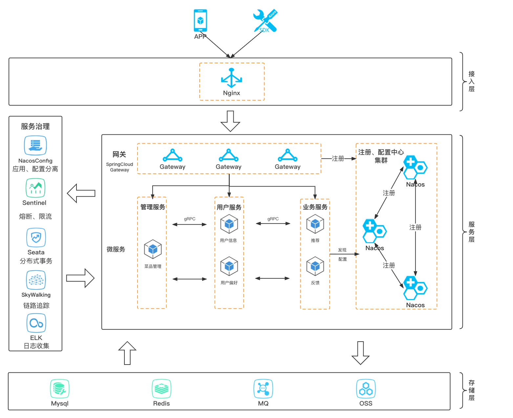
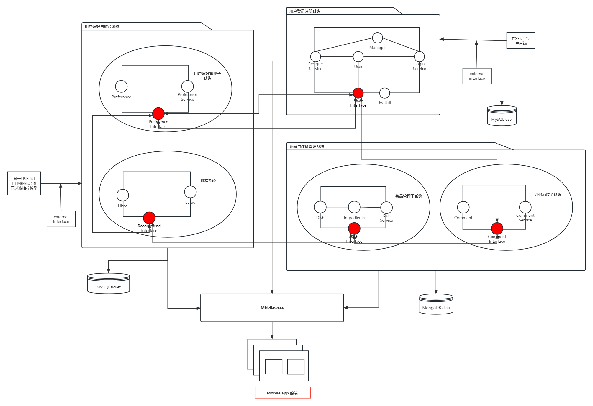
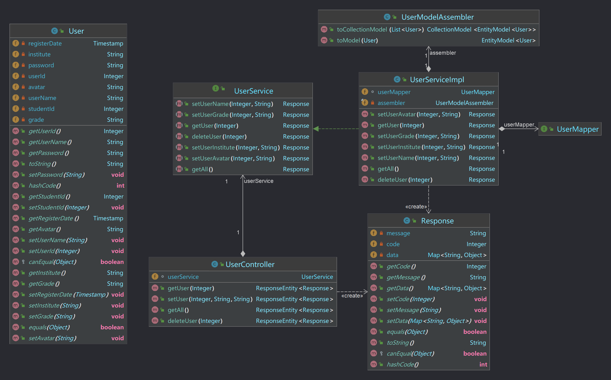

# 详细设计规约文档

修订历史记录：

| 编写日期   | SEPG     | 版本 | 说明         | 作者     | 备注 |
| ---------- | -------- | ---- | ------------ | -------- | ---- |
| 2022.12.15 | 饭饭团队 | v1.0 | 初版详细设计 | 夏佳幸   | 无   |
| 2022.12.23 | 饭饭团队 | v2.0 | 补充模块     | 饭饭团队 | 无   |
| 2023.1.02  | 饭饭团队 | v3.0 | 修改         | 饭饭团队 | 无   |

[toc]

## 1	引言

### 1.1	编写目的

本文档用于细化饭饭系统的详细设计，我们将通过微服务设计、接口设计、类详细设计三个角度规范饭饭系统开发中的编码方向、不同微服务之间的接口调用以及方法设计等。

### 1.2	背景与依据

本项目名为饭饭，旨在提供一个校园专属的餐饮平台，为学生们校园日常生活中的饮食选择提供更加个性化、更有价值的参考与建议。解决大部分同学日常就餐时选择困难的问题，同时也提供同学们相互交流讨论的渠道，进而反馈至相关餐饮服务人员对餐品的质量及时调整，优化校园餐饮环境，刺激良性竞争。

开发者团队为同济大学软件学院的四名本科生胡锦晖、杨思恒、李怿欣和夏佳幸一起完成；项目预期用户是同济大学嘉定校区的广大学生和有食堂用餐习惯的教职工，解决日常就餐的选择问题。

本项目的依据是《饭饭-软件需求规约》、《饭饭-软件需求分析规约》及《饭饭-软件概要设计规约》。

### 1.3	参考资料

1.   vantUI官网开发者文档

2.   nut-UI官网开发者文档

3.   《Design Patterns》
4.   mongoDB开发者文档

## 2	系统软件结构

### 2.1. 系统总体架构设计

本项目采用了API主导的微服务架构，将用户登录注册、智能推荐、反馈、用户偏好、菜品管理等不同的功能集合划分到不同的服务之中，其架构设计如下图所示：

### 2.2 系统软件结构设计

对2.1中的系统总体架构设计图中的软件功能部分进行软件系统结构设计（或称软件体系结构设计）。

## 3	微服务设计

在微服务设计中，为了避免在大批量请求微服务时线程被阻塞， 最终可能导致整个会员服务资源耗尽，无法继续对外提供服务。并且这种不可用可能沿请求调用链向上传递，从而引发服务间的雪崩效应。

我们为了尽量降低微服务间的耦合度，减少微服务间的依赖关系，我们将多个子系统合并成一个微服务，以贯彻“高内聚，低耦合”的思想。

### 3.1  微服务功能

​	饭饭总体划分为4个微服务，登录注册微服务、用户信息管理微服务、菜品管理微服务、用户偏好管理微服务。

#### 3.1.1. 登录注册微服务

​		登录注册微服务提供统一的后端访问入口，控制筛选token、开放接口以保证安全性，同时负责用户的登录和注册功能。其他微服务在登录注册微服务中注册，通过其完成对外交互以及内部的相互调用。

#### 3.1.2. 用户信息管理微服务

​		用户信息管理微服务负责用户的基本信息管理，包括用户个人信息修改、密码修改、用户注销等。

#### 3.1.3. 菜品管理微服务

​		菜品管理微服务主要负责两大部分功能，菜品维护以及评论功能，具体包括菜品的增删改查，对菜品的评价、评分等。

#### 3.1.4. 用户偏好管理微服务

​		用户偏好管理微服务主要负责基本偏好管理、用户画像建立和个性化推荐功能，包括个人偏好的增删改查，用户操作数据反馈、推荐模型调用等。

### 3.2  微服务交互

​		登录注册微服务提供统一的访问入口，所有微服务只和登录注册微服务进行直接交互，且每次对后端的请求需要经过登录注册微服务的身份以及接口验证。同时所有微服务注册在登录注册微服务，每个微服务之间的交互不直接进行，通过请求登录注册微服务再调用其他微服务完成。

## 4	类设计

### 4.1 用户信息管理微服务

主要的实体类为User，通过控制类UserCotroller完成用户信息的设置、获取以及用户的注销等功能管理。如下图所示：

下面详细介绍重要类的描述。

#### 4.1.1 User类

##### 4.1.1.1 功能

用户信息管理微服务的User类主要负责记录用户的个人信息，并且通过内部的方法实现信息修改和查询、注销等。

##### 4.1.1.2 输入项

用户初始建立时个人信息初始化为昵称为学号+同学，修改密码时，需要提供新、旧两个密码进行验证。

##### 4.1.1.3 输出项

包装为response进行输出。

##### 4.1.1.4 重要属性和方法描述

| 属性名 | 类型 | 说明 |
|-|-|-|
| userId | Integer | 区分用户的编号 |
| userName | String | 用户昵称 |
| password | String | 登录密码 |
| studentId | Integer | 学号，也可以用于区分用户 |
| registerDate | TimeStamp | 注册日期 |
| avatar | String | 头像url |
| institute | String | 学院 |
| grade | String | 年级 |

##### 4.1.1.5 限制条件及出错处理

用户登录密码由8至20位大小写字母、数字以及下划线组成且至少包含以上组合中的3种，用户输入非法的密码时，由前端检测并要求用户重新输入。

### 4.2 菜品信息管理微服务

主要的实体类为Comment、Dish和Preference，通过控制类CommentController和DishController主要完成对菜品添加评论以及根据口味相似度推荐菜品等功能管理。

#### 4.2.1 Comment类

##### 4.2.1.1 功能

菜品信息管理微服务的Comment类主要负责记录用户菜品的打分以及具体评价信息，并且通过内部的方法实现评价的查看和修改。

##### 4.2.1.2 输入项

新建或修改评价时，需要提供userId进行绑定，并提供打分以及填写的具体评价信息。

##### 4.2.1.3 输出项

包装为response进行输出。

##### 4.2.1.4 重要属性和方法描述

| 属性名 | 类型 | 说明 |
|-|-|-|
| _id | String | 用于区分评论的编号 |
| userId | Integer | 用户编号 |
| context | String | 用户评价 |
| score | Double | 用户打分 |
| commentDate | Date | 评价日期 |

##### 4.2.1.5 限制条件及出错处理

通过前端组件限制用户打分在0到5之间且以0.5为最小跨度，后端初始设置评分为0。

#### 4.2.2 Dish类

##### 4.2.2.1 功能

菜品信息管理微服务的Dish类主要负责记录菜品的图像、描述、所属食堂位置、价格、口味、原料以及用户评论等信息，可通过调用Comment类的方法对菜品的评价进行添加或修改，可通过与用户偏好口味进行相似度计算为用户推荐菜品

##### 4.2.2.2 输入项

由食堂管理员添加菜品，初始设置菜品评价列表为空。

##### 4.2.2.3 输出项

包装为Response进行输出。

##### 4.2.2.4 重要属性和方法描述

| 属性名 | 类型 | 说明 |
|-|-|-|
| _id | String | 菜品编号 |
| dishName | String | 菜品名称 |
| description | String | 菜品描述 |
| photoUrl | String | 菜品图片Url |
| position | String | 菜品所属食堂位置 |
| price | Double | 菜品价格 |
| score | Double | 菜品平均评分 |
| preference | Preference | 菜品口味 |
| ingredients | List\<String> | 菜品原料，用于忌口判断 |
| comments | List\<Comment> | 菜品评价列表 |

#### 4.2.3 Preference类

##### 4.2.3.1 功能

菜品信息管理微服务的Preference类主要负责从酸、甜、苦、辣四个维度表示菜品的口味。

##### 4.2.3.2 输入项

由食堂管理员添加菜品时录入四个维度的口味值。

##### 4.2.3.3 输出项

包装为Respose进行输出。

##### 4.2.3.4 重要属性和方法描述

| 属性名 | 类型 | 说明 |
|-|-|-|
| sourness | Integer | 酸度值 |
| sweetness | Integer | 甜度值 |
| bitterness | Integer | 苦度值 |
| spiciness | Integer | 辣度值 |

### 4.3 用户偏好管理微服务

主要的实体类为Preference和UserPreference，主要负责记录用户的个人偏好以及喜欢和吃过的菜品，并且通过内部的方法实现用户偏好的修改以及对喜欢和吃过菜品的修改，其中用户口味偏好被用于推荐相似菜品的依据。

#### 4.3.1 Preference类

##### 4.3.1.1 功能

用户偏好管理微服务的Preference类主要负责从酸、甜、苦、辣四个维度表示菜品的口味。

##### 4.3.1.2 输入项

由用户登录后传入酸、甜、苦、辣四个维度的口味偏好值。

##### 4.3.1.3 输出项

包装为Response进行输出。

##### 4.3.1.4 重要属性和方法描述

| 属性名 | 类型 | 说明 |
|-|-|-|
| sourness | Integer | 酸度值 |
| sweetness | Integer | 甜度值 |
| bitterness | Integer | 苦度值 |
| spiciness | Integer | 辣度值 |

##### 4.3.1.5 限制条件及出错处理

通过前端组件限制用户口味值设置在0到5之间且以1为最小跨度，后端初始设置四个维度均为0。

#### 4.3.2 UserPreference类

##### 4.3.2.1 功能

用户偏好管理微服务的UserPreference类主要负责记录用户个人口味、偏好菜品地区以及喜欢和吃过的菜品列表，可通过内部的方法对喜欢和吃过的菜品列表进行修改、评价等。

##### 4.3.2.2 输入项

修改用户偏好以及喜欢和吃过的菜品列表时，需先传入userId进行验证，再传入新的偏好值和对列表执行的操作。

##### 4.3.2.3 输出项

包装为Response进行输出。

##### 4.3.2.4 重要属性和方法描述

| 属性名 | 类型 | 说明 |
|-|-|-|
| _id | String | 用户偏好编号 |
| userId | Integer | 用户编号 |
| region | String | 口味偏好地区 |
| preference | Preference | 口味偏好 |
| likedDishes | List\<String> | 喜欢的菜品列表 |
| ateDishesCommented | List\<String> | 吃过已评价的菜品列表 |
| ateDishesNotCommented | List\<String> | 吃过未评价的菜品列表 |
| allergens | List\<String> | 忌口 |

##### 4.3.2.5 限制条件及出错处理

通过前端组件限制用户口味值设置在0到5之间且以1为最小跨度，后端初始设置四个维度均为0；初始地区为空，通过前端组件限制在“东北”、“华北”、“华东”、“华中”、“华南”、“西北”、“西南”，推荐时换算成口味偏好附加值；所有列表初始为空。