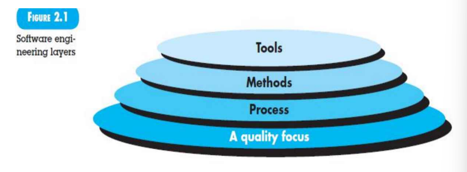
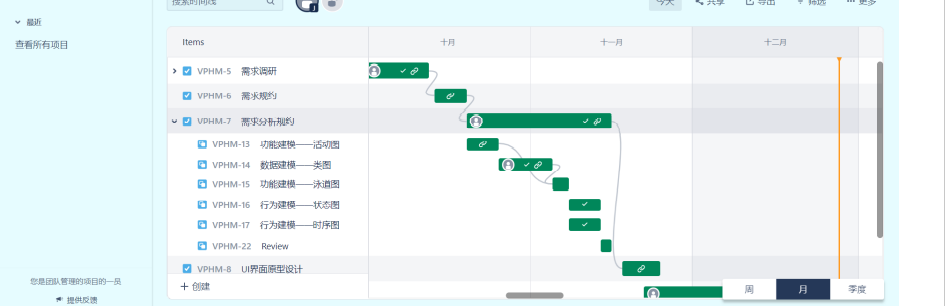
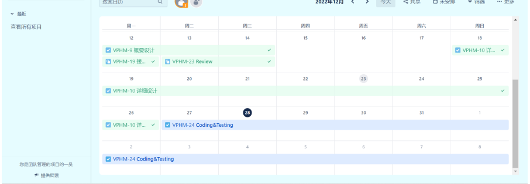
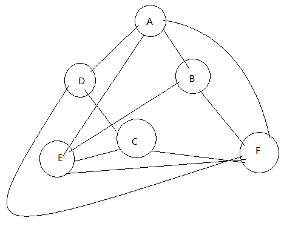
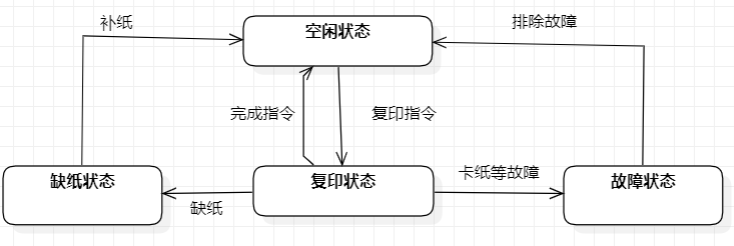
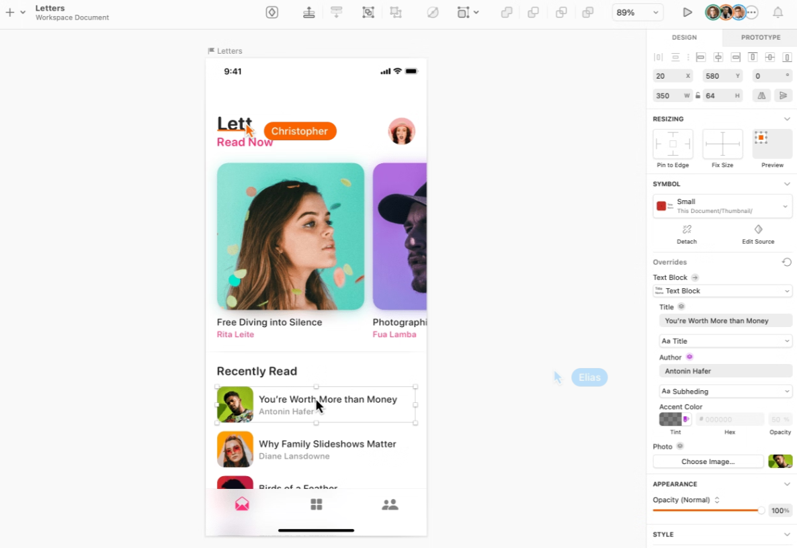
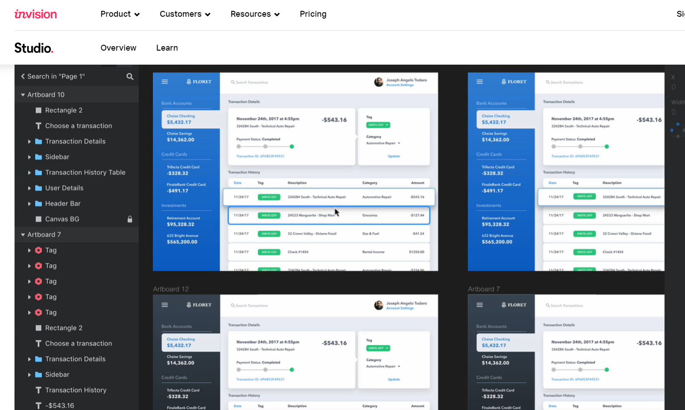
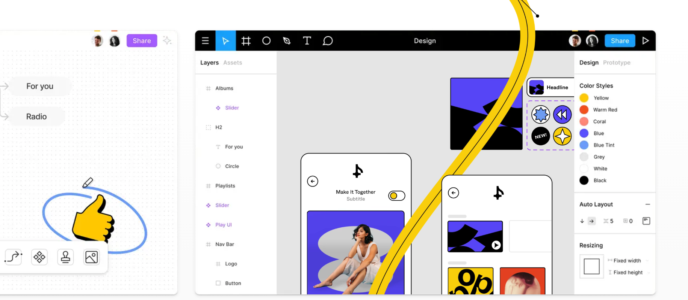
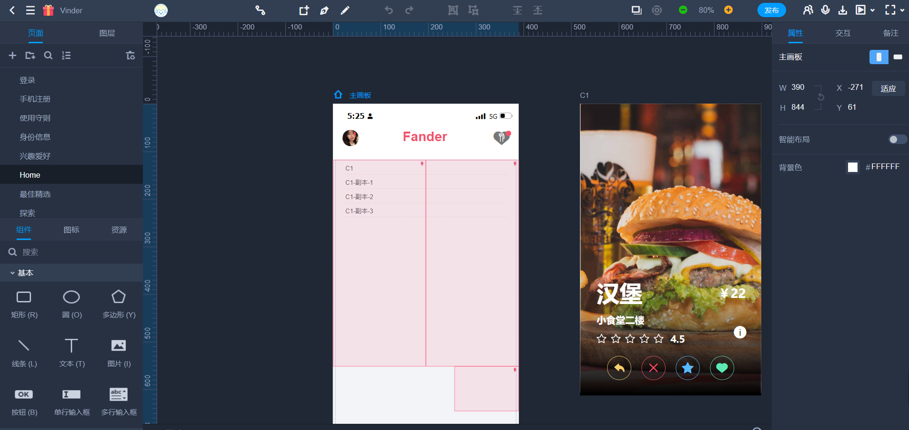
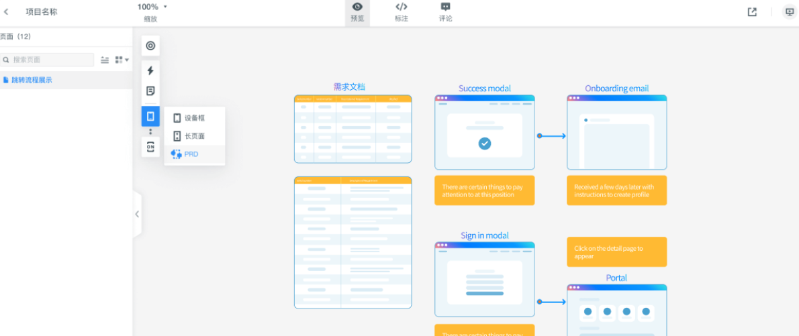

# 课程练习

> 1.查阅资料了解微服务和Devops.

微服务是⼀种架构风格，它将⼤型软件系统拆分为许多小的服务，每个服务都是独⽴的且聚焦于特定的任务。这些服务通常是用不同的编程语言编写的，并且可以使用不同的数据存储技术，目的是使系统更易于开发、维护、拓展，并提高效率。它的小尺寸使得开发团队可以快速迭代和部署代码，并使运维团队能够更轻松地监控和维护系统，当系统需要更多的处理能⼒时，可以在不影响其他服务的情况下添加新的服务来扩展系统，这使得系统可以更快速地响应增长，并且运维团队可以更轻松地扩展和缩放系统。此外，它也可以提高系统的可用性。因为每个服务都是独立的，所以单个服务的故障不会影响整个系统。这使得运维团队能够更快地修复故障，提高系统的可⽤性。

DevOps是⼀种软件开发方法，旨在缩短软件开发周期，提高质量，并使软件快速、可靠地部署。它的核心理念是将开发和运维团队紧密结合在⼀起，以改进软件开发、测试和部署的效率，且通常通过自动化工具和流程来实现，使开发和运维团队能够更快速地交付和部署软件；它还强调持续交付和持续集成。持续交付是指将软件不断地交付到生产环境，而持续集成是指将代码不断地合并到主干中，这有助于提高软件质量，并使团队能够更快地响应市场变化；它还强调监控和持续改进，通过工具和流程来监测系统的性能和可用性，并根据需要进行改进，保证系统的可靠性和效率。总的来说，DevOps 这种软件开发⽅法使用自动化⼯具和流程，以改进软件开发、测试和部署的效率。

> 2.By looking up information, to learn the history of web development.(web1.0~web4.0).

Web 1.0时期，互联网上的网站主要是静态的，用户只能查看信息，而不能交互。这个阶段的网站通常是静态的HTML文件，用户只能通过链接浏览不同的页面。

Web 2.0时期，网站开始支持用户交互，比如评论、点赞和分享。社交网络和博客等网站在这个时期变得流行起来。这个阶段的网站通常使用动态的网页技术，如JavaScript和Ajax，允许用户在网站上完成更多的操作。

Web 3.0时期，网站开始使用语义网技术，使机器能够更好地理解网页内容。这有助于提高搜索引擎的准确性，并为虚拟助手和智能设备提供更好的服务。这个阶段的网站可以根据用户的历史浏览记录、偏好和其他信息来为用户推荐相关的内容。

Web 4.0时期，网站开始使用人工智能和机器学习技术，使网站能够自动学习和适应用户的需求。这将使网站更加智能和个性化，并有可能为用户提供更好的体验。这个阶段的网站可以通过区块链技术实现去中心化和自治，并且可以通过物联网技术将网络连接到实体世界。

> 3.by looking up information, to learn cloud platform architecture.

云平台的架构通常包括以下几个部分：

1. 资源层（硬件基础设施）：有了物理机集群后，我们需要在物理机上建立虚拟机，以最小化资源成本（最大化资源利用率）。可以在物理机上独立开辟几个虚拟机，每台虚拟机相当于一个小型服务器，依然可以处理应用请求。我们采用KVM来给每一台虚拟机分配适量的内存、CPU、网络带宽和磁盘，形成虚拟机池。(KVM就是虚拟机监控器hypervisor，可以给虚拟机分配资源，当然也可以开关虚拟机。同样还有XEN和OVM)。

2. 虚拟层：使用虚拟化技术，在硬件基础设施上创建虚拟机，并分配资源给虚拟机使用。

二者合并为IaaS。

3. 中间件层（云平台服务，PaaS）：是云平台的核心层，主要功能为：对虚拟机池资源状态进行监测、预警、优化决策。①资源监测：实时监测当前各台虚拟机CPU、内存等使用情况，也监测用户应用请求，以便根据应用规模大小进行决策。②预警：根据当前虚拟机资源使用情况预测下一秒用户请求量，以便做出相应资源调整，防止宕机。③优化决策：预警之后，虚拟机要进行资源调度(迁移或伸缩)，采用何种调度策略，才能保证服务和资源利用率是研究重点。需要在虚拟机上搭建操作系统，文件存储系统，以及服务器，最应当有负载均衡系统Nginx，其实现中间件层功能，相当于网络中的路由器不处理数据，只进行数据转发，数据处理交有虚拟机上的tomcat服务器执行。（也相当于hadoop中的Namenode，其他虚拟机相当于datanode）。

4. 应用层（SaaS）：给用户提供可视化界面，应用若为存储：会给用户提供交互界面，建立文件夹，进行数据存储，以及其他界面，供用户选择操作。应用若为租用服务器：界面应该有租用的服务器资源状态。

> 4.Understand Figure 2.1 and find some process tools including open source tools and try to install and discuss them.

首先是最底层A quality focus⸺对于质量的关注，这⼀点支撑着整个软件工程的运作，是软件工程的基本原则，我们之所以要研究软件⼯程、并且在实际过程中按照软件⼯程的标准、方法、理论去实施、开展整个项目，最根本的原因就在于我们关注所开发软件的质量。 

然后是Process层⸺过程层面，这是软件工程的基础，软件⼯程的实施离不开这个层面，在项目开发的实施过程中，软件工程为我们提供了⼀套完整、规范的开发流程，虽说在不同的项目当中可能会对各个过程进行些许调整甚至裁剪，但是总体上、逻辑上我们仍旧是按照⼀套规范化的流程向前推进，若软件工程没了过程这⼀概念作为基础，我们就难以确保实施的活动合理有效，开发工作就会变得混乱无序。 

Methods层⸺即技术方法层，软件工程的⼀系列行之有效的方法为我们实际构建软件提供了技术指导，例如我们应该如何从根据one page的需求描述构建出用例图，又该如何根据用例图和文字描述构建出类图......这些都是软件⼯程带给我们的方法，借助这些方法，我们才能够更好地按照软件工程的标准⼀步步开展工作。 

最上层Tools层⸺即工具层，是说我们的软件工程离不开⼯具的使用，软件工程相关的各类⼯具为过程和⽅法提供了自动化或半⾃动化的⽀持，借助各类⼯具，我们可以在软件的开发过程中⼤幅提升开发效率，例如，使用自动化测试工具可以帮助我们快速执行大量的测试，而不用人工手动执行；借助工具，我们还可以更好地确保开发质量，例如，使用持续集成工具可以自动化构建、测试和部署流程，确保每⼀个版本都是可用的；还有⼀些例如协作工具帮助我们更好地沟通，协作.....总的来说，工具帮助我们提高工作效率、保证软件质量、支持团队协作...是软件工程过程中不可或缺的⼀部分。

JIRA是Atlassian公司出品的项目与事务跟踪工具，被广泛应用于缺陷跟踪、客户服务、需求收集、流程审批、任务跟踪、项目跟踪和敏捷管理等⼯作领域。 我们用其进行项目的进度管理、跟踪时间线：

Perforce是⼀款优秀的版本控制工具，其特性十分适用于游戏开发。

Bugzilla：开源缺陷跟踪系统，可以管理软件开发中缺陷的提交、修复、关闭等整个生命周期。是一个搜集缺陷的数据库。它让用户报告软件的缺陷从而把它们转给合适的开发者。开发者能使用bugzilla保持一个要做事情的优先表，还有时间表和跟踪相关性。  安装过程：安装MySQL数据库，并创建相应bugs数据库及bugs用户授予相应权限；安装activeperl；安装bugzilla，将安装包解压，然后配置IIS服务。使用bugzilla自带的checksetup.pl来安装bugzilla所需的perl模块。登陆bugzilla的页面了，打开一个网页，输入网址你配置的服务器地址就可以登陆bugzilla。

PingCode：是由国内老牌SaaS厂商Worktile 打造的智能化研发管理工具，是基于高效协作与敏捷研发理念，为不同规模研发团队提供Scrum、Kanban、知识库、迭代计划&跟踪、产品需求规划、缺陷跟踪、测试管理等，同时满足非研发团队的流程规划、项目管理和在线办公需要。该平台覆盖了研发管理的全生命周期，基于团队的管理场景创建规则，帮助减少重复性的工作，规范研发的流程，致力于帮助客户梳理研发的工作流，让产品更好更快地发布，轻松满足百人研发团队的管理需求。

> 5.学生管理系统中有一个模块专门处理课程考试时间安排，假设某软件学院开设了六门专业课：算法分析，形式语言，计算机图形学，模式识别，计算机网络，人工智能。五名学生选课情况如下表，要求设计考试日程安排，要尽可能在最段的时间安排完考试且考生不漏考，为解决这一问题选择一个合适的数据结构。

| 姓名 | 课1 | 课2 | 课3 |
|-|-|-|-|
| 丁一 | 算法分析A | 形式语言B | 计算机网络E |
| 马二 | 计算机图形学C | 模式识别D |  |
| 张三 | 计算机图形学C | 计算机网络E | 人工智能F |
| 李四 | 模式识别D | 人工智能F | 算法分析A |
| 王五 | 形式语言B | 人工智能F |  |

⾸先假设学生的选课信息在数据库中的存储方式为 [学⽣ID] [课程ID] 我们在考试日程安排算法中计划使用图（邻接矩阵）来解决该问题，借助图这种数据结构，我们可以 借助节点来代表出每一门课程，并且通过节点之间的边清晰地展现出各个课程在考试时间安排上的冲突关系。

具体过程如下：首先根据数据库中的信息，根据每个考试学生的ID找出其所选课程，然后将这些课程的冲突关系在邻接矩阵中表示出来，而后用贪心思想找出每天的考试科目。

具体为：遍历所有节点的冲突科⽬数量， 按照冲突数量由小到大的顺序依次尝试加入当天考试，若不和当天已选课程冲突（借助邻接矩阵）即可加入当天考试，按此确定了某天的考试科⽬后，将当天已选科目从图中删除，更新邻接矩阵。如此往复，得到每天的考试安排，直到待选节点个数为零。即完成考试安排。 按此方法得到最后的结果是：

[B C] [D E] [A] [F] 或 [A C] [D E] [B] [F]

> 6.构建打印机或复印件软件系统的状态图

> 7.find a tool that creates the user interface prototype

1. Sketch：是一款专为设计师和产品经理设计的工具，用于创建高质量的用户界面原型。

   

   

2. InVision Studio：是一款全面的设计工具，可用于创建用户界面原型、设计动画和进行协作。

   

3. Adobe XD：是一款设计工具，可用于创建用户界面原型、测试设计并进行协作。

4. Figma：是一款在线设计工具，可用于创建用户界面原型、进行协作和在线演示设计。

   

国内：

1. 摹客、摹客RP

   

   

2. 墨刀

   

   

   