# `饭饭` 软件需求（分析）说明书（规约）

## 1. 引言

### 1.1. 背景

### 1.2. 参考资料

### 1.3. 假定和约束

### 1.4. 用户的特点

## 2. 功能需求

### 2.1. 系统范围

### 2.2. 系统体系结构

`饭饭` 采用了API主导的微服务架构，将用户登录注册、智能推荐、反馈、用户偏好、菜品管理等不同的功能集合划分到不同的服务之中，其架构设计如下图所示：

### 2.3. 系统总体流程

### 2.4. 需求分析

#### 2.4.1. 用户登录注册子系统

##### 2.4.1.1. 整体数据建模

在本模块，需要建模的数据都来自于用户，而用户的操作涉及到登陆、注册、找回和修改密码、对个人信息的操作以及充值校园卡等。在注册和找回密码时，用户需要通过填写验证信息进行验证，而登陆时则通过学号与密码一起比对进行判断用户身份。登陆后系统会记录用户的唯一标识符。

##### 2.4.1.2. 用户注册用例

###### a. 功能建模

  游客通过同济大学学生学号进行注册，统一身份认证成功后填写验证信息，系统判断该账号未注册后即可获得系统账号。

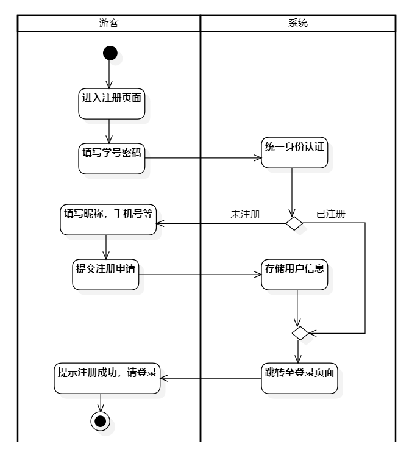

###### b. 行为建模

用户注册的状态转换如下图所示：

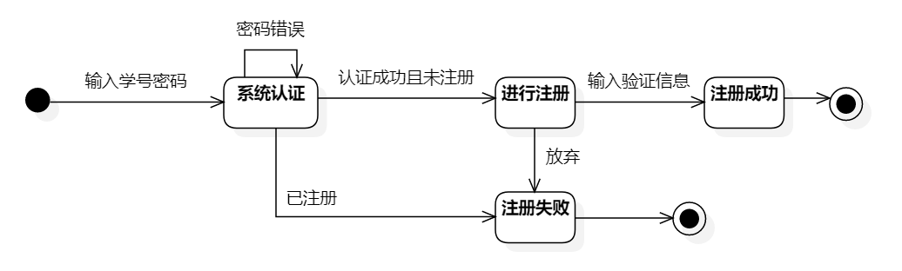

##### 2.4.1.3. 用户登录用例

###### a. 功能建模

已经过注册的游客通过学号与统一认证登录密码进入系统成为注册用户。

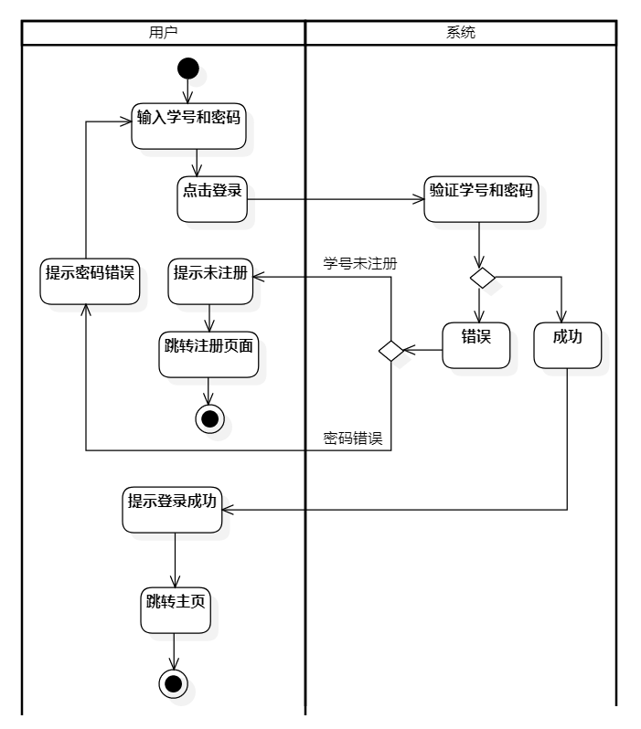

###### b. 行为建模

用户登陆的状态转换如下图所示：

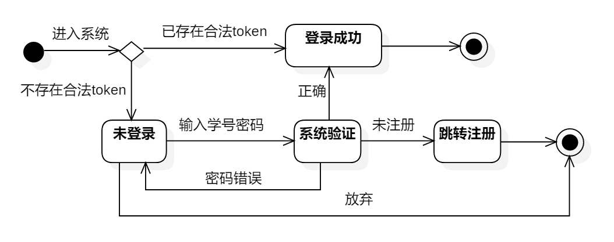

##### 2.4.1.4. 找回密码用例

###### a. 功能建模

游客忘记自己学号对应的密码，通过输入验证信息来重置密码。

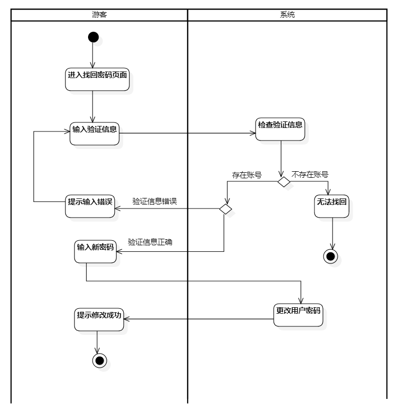 

###### b. 行为建模

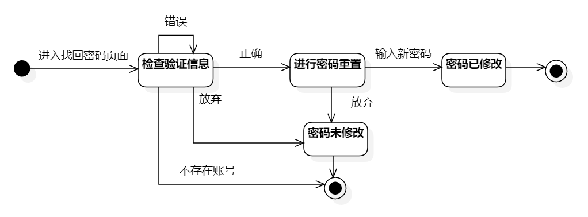

##### 2.4.1.5. 修改个人资料用例

###### a. 功能建模

注册用户可以进行个人资料以及账户密码修改。

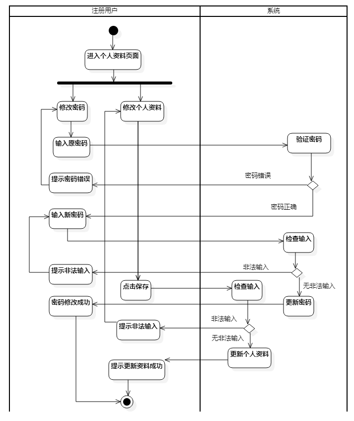

###### b. 行为建模

##### 2.4.1.6. 校园卡充值用例

###### a. 功能建模

注册用户可以对绑定的校园卡进行充值，选择充值金额后系统唤起第三方支付平台，用户进行支付后完成充值。

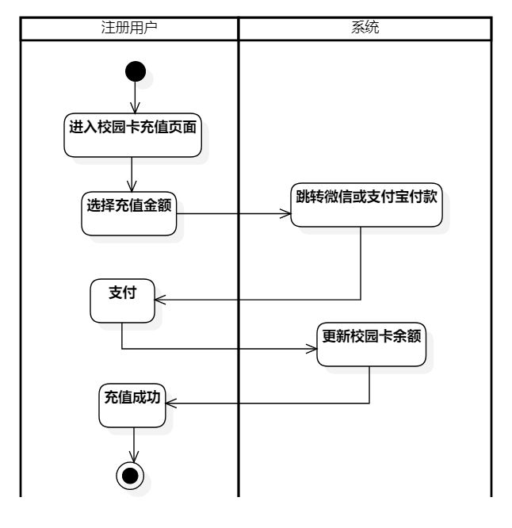

###### b. 行为建模

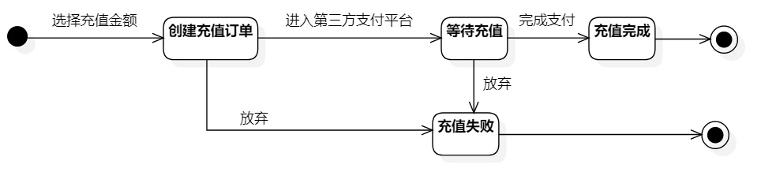

#### 2.4.2. 推荐子系统

#### 2.4.3. 检索与反馈子系统

##### 2.4.3.1 整体数据建模

注册用户可以浏览所有菜品的相关信息，包括热门高分菜品的推荐、菜品的详细信息以及相关的用户评价。其中菜品的基本信息在菜品管理系统中由食堂管理员和系统管理员进行维护，菜品的相关评价则由注册用户添加，系统管理员进行审核。

##### 2.4.3.2 浏览菜品用例

###### a.功能建模

注册用户进入该系统后可直接浏览热门菜品的模块，点击某一具体菜品后可查看菜品的详细信息以及评价。

##### 2.4.3.3 检索菜品用例

###### a.功能建模

​	注册用户进入可以有目的地搜索筛选需要浏览的菜品

##### 2.4.3.4 添加评价用例

###### a.功能建模

​	注册用户可以对享用过的菜品进行评价，评价经过审核后会公开展示在菜品详情页，并作为菜品的评分标准。

##### 2.4.3.5 提醒评价用例

###### a.功能建模

用户登陆后，若检测到用户有享用过但还未评价的餐品时，提醒用户对菜品进行评价。

##### 2.4.3.6 审核评价用例

###### a.功能建模

管理员审核用户评价

###### b.数据建模

#### 2.4.4. 用户偏好子系统

##### 2.4.4.1. 修改用户偏好用例

###### a. 功能建模

注册用户可以输入并修改自己的口味偏好，系统会根据填写的口味偏好进行推荐。

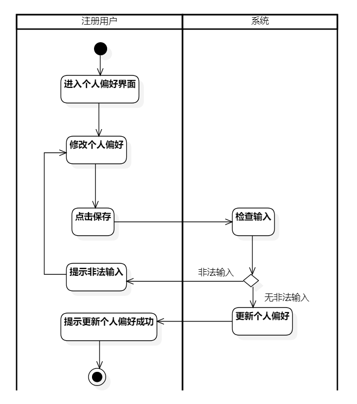

###### b. 行为建模

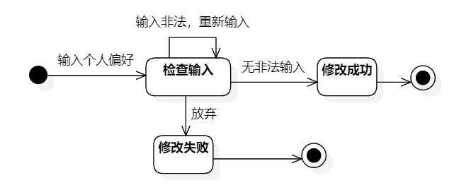

##### 2.4.4.2. 管理”Liked“用例

###### a. 功能建模

注册用户可以浏览自己曾经标记“吃过”的菜品信息并进行取消"Liked"操作，点击某个菜品可以跳转至详细界面。

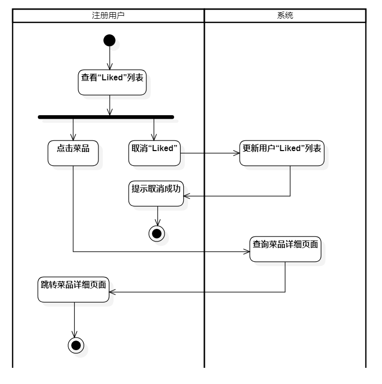

###### b. 行为建模

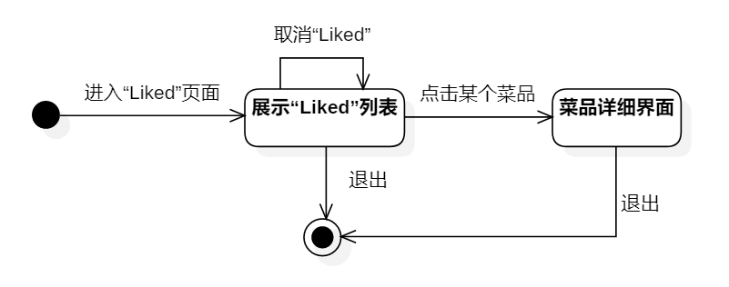

##### 2.4.4.3. 管理”吃过“用例

与管理“Liked”列表相似，见2.4.4.2.

### 2.4.5 菜品管理子系统

#### 2.4.5.1 整体数据建模

在本子系统中，主要涉及到对房源信息和房间信息的获取和操作，及对订单信息，评价信息，房客信息的获取与数据分析。其中，管理房源信息需要房源信息控制类对房源实体进行获取和实时维护；查看房源销量图表涉及到使用不同的数据分析算法对某一具体房源和所有订单作数据分析；而管理广告接入则需要广告管理控制类与外部广告接口作交互。

#### 2.4.5.2. 添加菜品信息用例

###### a. 功能建模

###### b. 行为建模

#### 2.4.5.3. 更新菜品信息用例

#### 2.4.5.4. 删除菜品信息用例

#### 2.4.5.5. 审核菜品信息用例

#### 2.4.5.6. 生成分析报表用例

## 3. 非功能需求

## 4. 运行环境规定

### 4.1. 设备

`饭饭` 以移动端App形式呈现，因此运行该软件所需要的硬件设备为一台移动电话，以测试用移动电话为例，硬件条件为：

1. SOC型号：Snapdragon 8+ Gen1
2. 内存容量：12GB LPDDR5 6400Mbps
3. 外存容量：512GB
4. 无特殊输入及输出设备、无数据通信设备

### 4.2. 支持软件

因以移动端App形式呈现的原因，该软件需要运行在移动设备之上，因此该软件支持软件如下：

1. 操作系统平台：Android、IOS
2. 数据库系统平台：MySQL、MongoDB
3. 网络和硬件设备平台：无特殊网络需求，联网即可使用软件

### 4.3. 接口

本系统在运行过程中，由于业务逻辑需要，调用了其他系统的接口以更好的完成本系统的功能。所调用的接口，如下所示：

- 同济大学统一身份认证接口：由于本系统目标用户为同济大学嘉定校区全体学生，为保证用户数据的真实性，系统调用了同济大学统一身份认证接口进行身份认证。
- 支付接口：本系统在进行校园卡充值的过程中，需要完成支付操作。为了完成本操作，系统调用了支付宝的支付接口以完成该操作。

### 4.4. 控制

该软件的运行方式为：

- 下载 `饭饭` App
- 验证个人信息
- 通过触控屏幕交互方式实现需求功能

该软件无需控制信号，在未登录状态下可以进行部分操作，如需使用软件全部功能，需要进行登录与身份信息认证的操作，该身份信息来源于个人注册并通过同济大学统一身份认证。