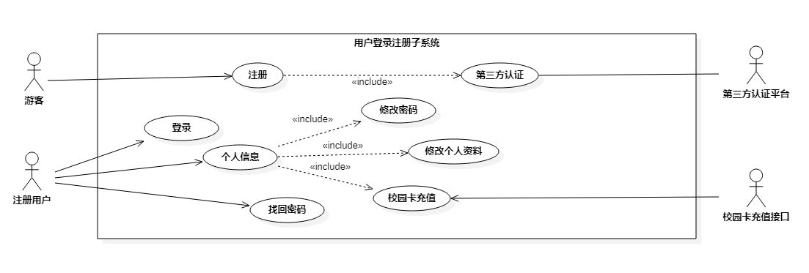
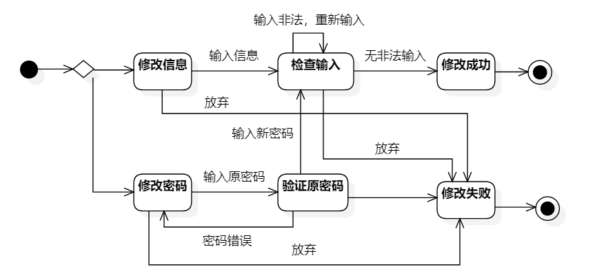

# `饭饭` 软件需求（分析）说明书（规约）

修订历史记录：

| **编写日期** | **SEPG** | **版本** | **说明**                       | **作者** |
| ------------ | -------- | -------- | ------------------------------ | -------- |
| 2022.11.08   | 饭饭团队 | 1.0      | 需求分析规约初始模板           | 胡锦晖   |
| 2022.11.15   | 饭饭团队 | 2.0      | 各部分模块文档的填写           | 饭饭团队 |
| 2023.1.03    | 饭饭团队 | 3.0      | 根据具体的项目实现修改部分用例 | 饭饭团队 |

## 目录

[TOC]

## 1. 引言

### 1.1. 背景

本项目名为饭饭，旨在提供一个校园专属的餐饮平台，为学生们校园日常生活中的饮食选择提供更加个性化、更有价值的参考与建议。解决大部分同学日常就餐时选择困难的问题，同时也提供同学们相互交流讨论的渠道，进而反馈至相关餐饮服务人员对餐品的质量及时调整，优化校园餐饮环境，刺激良性竞争。

开发者团队为同济大学软件学院的四名本科生胡锦晖、杨思恒、李怿欣和夏佳幸一起完成；项目预期用户是同济大学嘉定校区的广大学生和有食堂用餐习惯的教职工，解决日常就餐的选择问题。

为了更方便地为校园用户提供服务，我们拟将项目接入校园系统的统一身份认证接口和校园卡充值接口，以及支付宝和微信的支付接口，但限于项目开发的时间较短，以及身份认证申请等客观因素还未完全实现，只搭建了基础的模拟接口，便于后续完整功能的扩展和实现。

### 1.2. 参考资料

1.   vantUI官网开发者文档

2.   nut-UI官网开发者文档

3. 《Design Patterns》
4.   mongoDB开发者文档

### 1.3. 假定和约束

本项目开发主要受软件工程课程以及疫情的约束，因此本项目的假定和约束如下所示：

1. 项目开发期限为2个月，时间为2022年11月底至2023年1月初；
2. 项目开发无经费，设备条件为3台Windows操作系统电脑和1台Mac操作系统电脑以及云服务器、图床等；
3. 项目通过问卷调研的方式获取用户数据，并据此我们制定了用户画像；
4. 团队交流方面通过Github、Youtrack等进行代码协作以及团队任务管理。

### 1.4. 用户的特点

本系统针对普通的使用用户来说并没有太大的要求，使用者多数为同济大学的大学生，对软件的使用操作本就有一定的熟悉程度，对于有食堂用餐需求的教职工来说也应具有一定的手机使用习惯。除了核心的饭饭功能逻辑较为抽象和复杂，需要简单的引导讲解即可正常使用，因此，本系统在操作交互层面上的设计较为友好。

针对于食堂管理的维护人员也并无太高的要求，只需正常地认识基础汉字，并及时关注更新食堂菜品的时效性，即可完成对食堂菜品信息的维护。

而对于系统管理员的则需要对整个系统数据库有一定程度的了解，同时掌握SpringBoot技术栈，了解基本的Http协议。此外，还应当对于前端使用的Vue框架以及MySQL、MongoDB数据库有一定的了解。

## 2. 功能需求

### 2.1. 系统范围

本项目的项目范围包括用户、食堂管理员和系统管理员三个主体。核心主体是由食堂创建的食堂菜品，食堂管理员在菜品上的创建、编辑、搜索等操作涉及到数据库层面的增删改查；系统管理员可以定期进行系统维护以及用户数据收集，生成报表反馈给学校食堂来帮助食堂分析学生的口味偏好，提高食堂的菜品质量；对于用户本系统的核心功能是菜品卡片的滑动来喜欢或不喜欢以及对菜品进行评价，为学生提供食堂菜品更纯粹的评价参考信息。对于用户认证我们拟使用同济大学统一身份认证系统接口，保证所有的系统用户都是同济大学学生，保证评论的质量和参考价值。

### 2.2. 系统体系结构

`饭饭` 采用了API主导的微服务架构，将用户登录注册、智能推荐、反馈、用户偏好、菜品管理等不同的功能集合划分到不同的服务之中，其架构设计如下图所示：

### 2.3. 系统流程

系统共有游客、注册用户（学生）、食堂管理员、系统管理员四种用户身份，对应了不同的系统使用流程。每个系统的使用流程会在后面的各个子系统中详细说明。

游客身份为初次使用系统的学生，只能进行注册，系统认证其为同济大学学生后成为注册用户。

注册用户（学生）身份的用户才能使用平台的绝大部分功能，比如进行菜品查询、评论、设置个人偏好以及获取推荐菜品，对菜品进行喜欢和不喜欢的偏好选择等。

食堂管理员主要管理菜品信息，对系统中的食堂菜品信息进行增删改查，结果交由系统管理员审核并发布。同时一定时间获取用户的分析报表，根据报表了解学生偏好以及部分菜品的口味问题，对于食堂的菜品进行调整。

系统管理员主要负责审核菜品信息、发布菜品信息和定期根据后台数据生成分析报表给予食堂管理员。

### 2.4. 需求分析

#### 2.4.1. 用户登录注册子系统

##### 2.4.1.1. 整体数据建模

在本模块，需要建模的数据都来自于用户，而用户的操作涉及到登陆、注册、找回和修改密码、对个人信息的操作以及充值校园卡等。在注册和找回密码时，用户需要通过填写验证信息进行验证，而登陆时则通过学号与密码一起比对进行判断用户身份。登陆后系统会记录用户的唯一标识符。

##### 2.4.1.2. 用户注册用例

###### a. 功能建模

  游客通过同济大学学生学号进行注册，统一身份认证成功后填写验证信息，系统判断该账号未注册后即可获得系统账号。

###### b. 行为建模

用户注册的状态转换如下图所示：

##### 2.4.1.3. 用户登录用例

###### a. 功能建模

已经过注册的游客通过学号与统一认证登录密码进入系统成为注册用户。

###### b. 行为建模

用户登陆的状态转换如下图所示：

##### 2.4.1.4. 找回密码用例

###### a. 功能建模

游客忘记自己学号对应的密码，通过输入验证信息来重置密码。

 

###### b. 行为建模

##### 2.4.1.5. 修改个人资料用例

###### a. 功能建模

注册用户可以进行个人资料以及账户密码修改。

###### b. 行为建模

##### 2.4.1.6. 校园卡充值用例

###### a. 功能建模

注册用户可以对绑定的校园卡进行充值，选择充值金额后系统唤起第三方支付平台，用户进行支付后完成充值。

###### b. 行为建模

#### 2.4.2. 推荐子系统

#### 2.4.3. 检索与反馈子系统

##### 2.4.3.1 整体数据建模

注册用户可以浏览所有菜品的相关信息，包括热门高分菜品的推荐、菜品的详细信息以及相关的用户评价。其中菜品的基本信息在菜品管理系统中由食堂管理员和系统管理员进行维护，菜品的相关评价则由注册用户添加，系统管理员进行审核。

##### 2.4.3.2 浏览菜品用例

###### a.功能建模

注册用户进入该系统后可直接浏览热门菜品的模块，点击某一具体菜品后可查看菜品的详细信息以及评价。

##### 2.4.3.3 检索菜品用例

###### a.功能建模

​	注册用户进入可以有目的地搜索筛选需要浏览的菜品

##### 2.4.3.4 添加评价用例

###### a.功能建模

​	注册用户可以对享用过的菜品进行评价，评价经过审核后会公开展示在菜品详情页，并作为菜品的评分标准。

##### 2.4.3.5 提醒评价用例

###### a.功能建模

用户登陆后，若检测到用户有享用过但还未评价的餐品时，提醒用户对菜品进行评价。

##### 2.4.3.6 审核评价用例

###### a.功能建模

管理员审核用户评价

###### b.数据建模

#### 2.4.4. 用户偏好子系统

##### 2.4.4.1. 修改用户偏好用例

###### a. 功能建模

注册用户可以输入并修改自己的口味偏好，系统会根据填写的口味偏好进行推荐。

###### b. 行为建模

##### 2.4.4.2. 管理”Liked“用例

###### a. 功能建模

注册用户可以浏览自己曾经标记“吃过”的菜品信息并进行取消"Liked"操作，点击某个菜品可以跳转至详细界面。

###### b. 行为建模

##### 2.4.4.3. 管理”吃过“用例

与管理“Liked”列表相似，见2.4.4.2.

### 2.4.5 菜品管理子系统

#### 2.4.5.1 整体数据建模

在本子系统中，主要涉及到对菜品信息的录入和操作从而对菜品实体进行维护，及对菜品评价、评分和喜欢信息获取与数据分析。其中，管理菜品信息对菜品实体进行获取和实时维护；生成报表分析用例会使用数据分析算法对具体的数据范围作可视化的数据报表。

#### 2.4.5.2. 管理菜品信息用例

###### a. 功能建模

食堂管理员可以对菜品实体信息进行录入、修改和删除操作，并交由系统管理员进行审核并发布。

###### b. 行为建模

#### 2.4.5.3. 生成分析报表用例

根据食堂管理员选择的范围生成对应的数据报表，进行可视化的数据分析以调整运营策略。

###### a.功能建模

## 3. 非功能需求

### 3.1. 安全性需求

主要考虑**保密性、可靠性和完整性**三个子特性。

**对于保密性**，饭饭平台需要构建完善的鉴权机制以实现数据不能被授权用户以外的任何人访问的能力。未登录的用户和已登录的用户看到的页面信息是不同的；用户查看其他用户的信息范围也应是不同的。而对于用户输入的包括身份证号、密码等信息也应使用完善的加密机制以安全无法被访问的形式存储于数据库中。各种信息的安全性需求初步分析如下：
所有用户的个人信息由用户本人进行维护，此外其中的基本信息公开，授权人员可以更新；私密信息保密，数据库管理员可维护更新；
菜品信息，由食堂管理员进行维护，信息公开，授权人员可以查询，更新需要经过审批；
反馈系统发表反馈与评价时，由所属用户进行维护，信息公开，更新发布需由系统管理员进行审批。

**对于可靠性**，饭饭平台需要无故障地持续运行。普通用户在推荐页面获取推荐菜品时，系统需要根据用户的提前预设的口味偏好以及历史的就餐数据反馈进行分析得出菜品的智能推荐，不应出现推荐失败的情况；食堂管理员填写更新菜品信息后，菜品信息应准确可观地向用户展示；用户对品尝过的菜品进行反馈后，反馈信息应准确地展示在相关菜品的详情页；系统管理员审核相关信息时，信息也需准确无误的传达给管理员，并准备地将审核结果反馈给用户。以上君为饭饭平台要满足的基本的可靠性需求。

**对于完整性而言**，饭饭平台应完成业务需求和系统正常运行要求的功能，主要包括数据管理功能，即用户可以自行更新维护自己的个人信息、口味偏好和发布的反馈评论，以及用户管理功能，用户可以自行管理自己账户的状态，如注册，登录和注销等等。

对于其中保证用户核心安全性的身份认证机制而言，拟采用如下的技术进行实现：前端每次在登录的过程中将会由后端生成一段token信息，并存储到localStorage中。在发送所有API请求的过程中，将会自动将当前token信息放在request请求的头部（headers）中的Authorization字段，如果当前没有token则通过路由守卫跳转到登录界面重新获取token。后端在接受到请求后，会先检验该Token信息是否过期。如果过期或者该用户无权限进行该操作，JWT会直接返回errorCode码。反之，返回该请求的结果。而前端接收到返回值后，如果发现请求失败，token过期失效，将会跳转到首页提醒登录过期，并需要用户重新登录获取新的token才能完成其他请求。反之，正常进行数据处理和页面展示。

### 3.2. 易用性需求

从平台的业务逻辑来看，本系统应满足以下最基本的易用性需求：

1. 推荐菜品功能的逻辑要尽可能地简洁易懂，作为核心功能需要最大限度优化用户体验效果，尽可能减少繁杂的深度逻辑操作，简单快速地帮助用户做决定参考。
2. 用户填写预设个人口味偏好时，偏好维度和关键词要尽可能地通俗易懂，需要一定程度的模糊描述，便于用户填写，同时保证用户数预设偏好对推荐结果有一定影响。
3. 用户填写餐品反馈时输入的提示要尽可能清晰易懂，需要输入的信息尽可能精炼高效，以便提高用户填写反馈的积极性也能保证信息有一定参考价值。

### 3.3. 可维护性与可扩展性需求

饭饭平台服务用户主要为为同济大学嘉定校区的全体师生，上线后将一直保持运行状态，因此进行实时的维护和更新是十分重要的。从决定可维护性的因素出发：

1. 系统大小：平台计划面向的用户规模应达到万人级。
2. 系统的年龄：平台上线后计划持续上线。
3. 结构合理性：平台拟采用微服务架构进行开发部署，不同的业务在不同的微服务内进行维护和部署，结构合理。
4. 可测试性：系统应在保证当前业务正常运作的情况下实现各模块的独立测试，保证测试的独立性和方便性。
5. 可修改性：系统的各微服务的前后端代码应保证开放-封闭原则，在进行业务的扩充和业务的修改时尽量保证现有模块无需进行大幅度修改。
6. 

## 4. 运行环境规定

### 4.1. 设备

`饭饭` 以移动端App形式呈现，因此运行该软件所需要的硬件设备为一台移动电话，以测试用移动电话为例，硬件条件为：

1. SOC型号：Snapdragon 8+ Gen1
2. 内存容量：12GB LPDDR5 6400Mbps
3. 外存容量：512GB
4. 无特殊输入及输出设备、无数据通信设备

### 4.2. 支持软件

因以移动端App形式呈现的原因，该软件需要运行在移动设备之上，因此该软件支持软件如下：

1. 操作系统平台：Android、IOS
2. 数据库系统平台：MySQL、MongoDB
3. 网络和硬件设备平台：无特殊网络需求，联网即可使用软件

### 4.3. 接口

本系统在运行过程中，由于业务逻辑需要，调用了其他系统的接口以更好的完成本系统的功能。所调用的接口，如下所示：

- 同济大学统一身份认证接口：由于本系统目标用户为同济大学嘉定校区全体学生，为保证用户数据的真实性，系统调用了同济大学统一身份认证接口进行身份认证。
- 支付接口：本系统在进行校园卡充值的过程中，需要完成支付操作。为了完成本操作，系统调用了支付宝的支付接口以完成该操作。

### 4.4. 控制

该软件的运行方式为：

- 下载 `饭饭` App
- 验证个人信息
- 通过触控屏幕交互方式实现需求功能

该软件无需控制信号，在未登录状态下可以进行部分操作，如需使用软件全部功能，需要进行登录与身份信息认证的操作，该身份信息来源于个人注册并通过同济大学统一身份认证。

