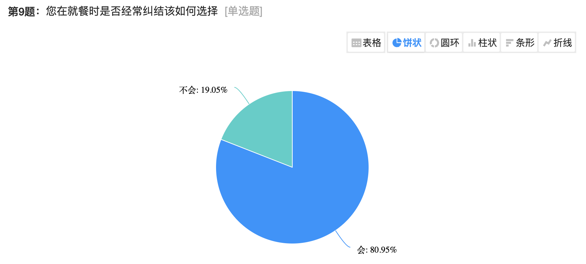
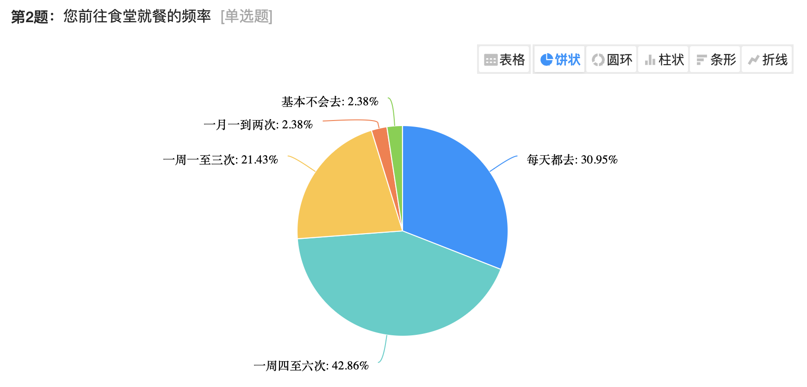
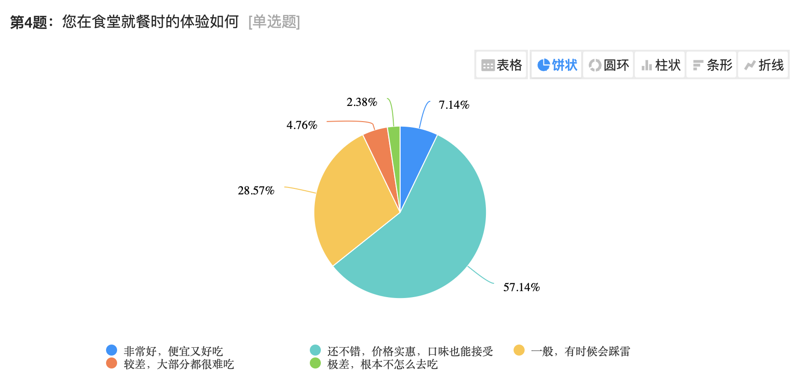
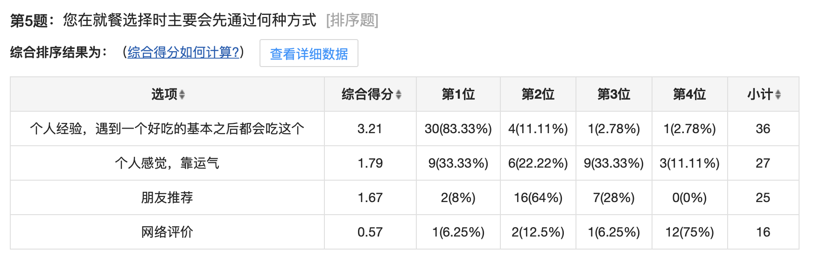
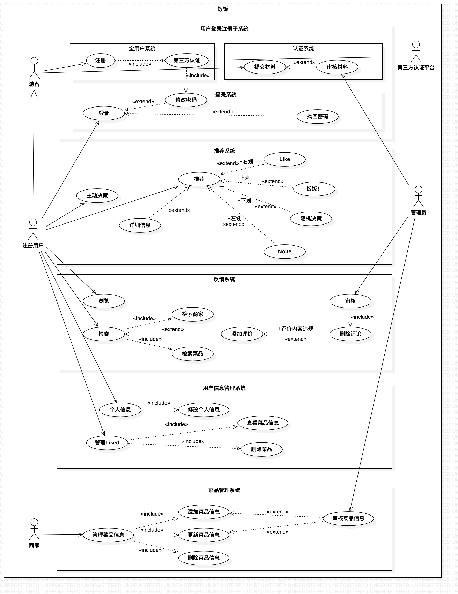
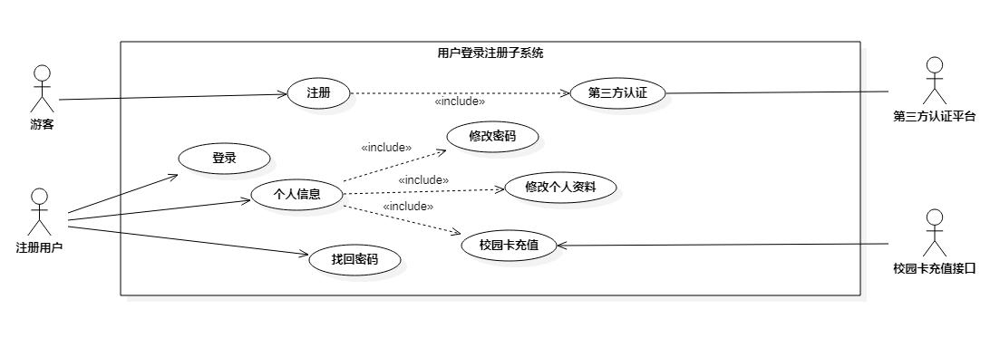
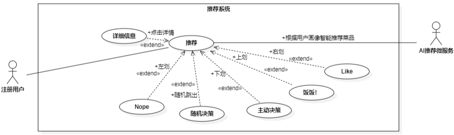
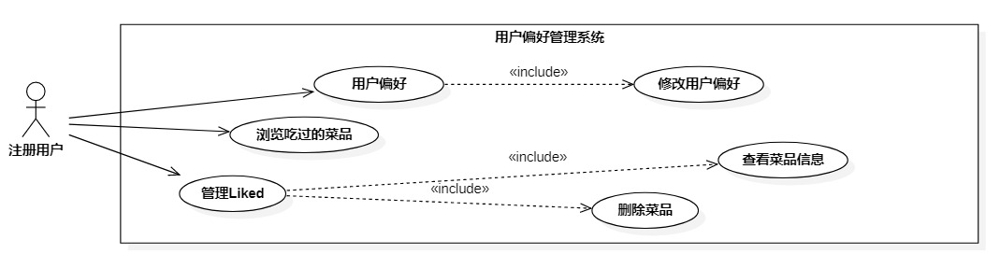
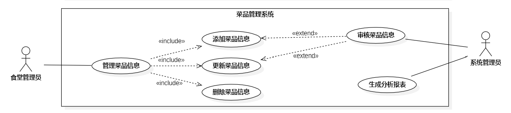

# 饭饭校园餐饮平台需求规约（说明书）

修订历史记录：

| **编写日期** | **SEPG** | **版本** | **说明**                       | **作者** |
| ------------ | -------- | -------- | ------------------------------ | -------- |
| 2022.11.07   | 饭饭团队 | 1.0      | 需求规约初始模板               | 杨思恒   |
| 2022.11.15   | 饭饭团队 | 2.0      | 各部分模块文档的填写           | 饭饭团队 |
| 2023.1.03    | 饭饭团队 | 3.0      | 根据具体的项目实现修改部分用例 | 饭饭团队 |

## 目录

[TOC]

## 1.背景及产品介绍

一日三餐是我们生活中的刚需，而作为大学生，大多数都会选择在食堂或校园外卖解决日常就餐问题，而食堂为了丰富学生的就餐选择，建设制定了多种菜品和就餐方案，外卖的个人商户也是丰富多样，但同时也会带来学生就餐选择上的烦恼。
本项目旨在提供一个校园专属的餐饮平台，为学生们校园日常生活中的饮食选择提供更加个性化、更有价值的参考与建议。解决大部分同学日常就餐时选择困难的问题，同时也提供同学们相互交流讨论的渠道，进而反馈至相关餐饮服务人员对餐品的质量及时调整，优化校园餐饮环境，刺激良性竞争。
本项目的服务范围分为普通用户、商户和管理员。商户们添加各自的服务菜品作为本项目的核心对象，以此为普通用户推荐本餐菜品时本项目的核心功能，用户可以在个人界面提前填写一些个人信息和口味偏好预设推荐参数，进而影响个性化推荐结果。同时也提供反馈交流系统，普通用户对品尝过的菜品进行公开的评价反馈，为其他用户提供参考，也反馈至商户用于菜品改进。

## 2.整体描述

项目名为饭饭，是基于Vue和SpringBoot框架开发的App应用。项目期望能为在校大学生提供高效的就餐选择方式。此外，项目的界面风格和交互逻辑方式都最大程度上从用户角度出发，提高产品的精致度和美观度，进而打造舒适的交互体验。

## 3.系统与其它系统的接口

项目系统的外部接口主要有：

1. 推荐模型接口。项目将使用模型分析用户偏好并根据用户画像进行个性化推荐。
2. 校园平台的统一身份认证系统。在注册新用户时，系统会将用户的学号与密码与统一身份认证平台进行验证，确认用户的真实信息。
3. 校园平台的校园卡充值系统。由于项目期望与学校食堂强相关，为提高用户的使用频率，我们拟接入校园的校园卡充值平台，便捷就餐生活。
4. 七牛云图床的空间管理接口，用于统一管理图片资源。
5. 微信支付宝的支付接口，用于支付校园卡充值。

## 4.需求调研

我们通过 **[问卷形式](https://www.wjx.cn/vm/rpP7alZ.aspx)** 调研了目前同济大学嘉定校区在校生对于校内及学校附近就餐选择的需求，其中主要有三个问题亟待解决：

1. 绝大多数同学存在就餐选择困难

2. 部分同学在食堂的就餐体验不尽如人意

我们发现，超过70%的同学在食堂就餐的频率很高，但却有接近半数的同学对食堂菜品的评价并不好，这说明部分经常在食堂就餐的同学并不能很好的满足自己的口味需求。

3. 大多数同学有尝鲜需求但并没有付诸行动

可以看到，绝大多数同学习惯于根据个人经验进行就餐选择，遇到一个好吃的之后会经常吃这个，但他们中的大多数对于这种方式的评价很一般，我们可以推测，这部分同学有着尝鲜新品的需求，但单纯通过碰运气、参考网络评价的方式也并不能很好的满足自己的口味需求。

同时我们也可以推测：在食堂拥有近百种菜品提供的情况下，第二个问题中仍有近半数同学无法在食堂很好的满足自己的口味需求，他们与本问题中有尝鲜需求但并没有付诸行动的人群或许有着高度重合

## 5.功能性需求描述

### 5.1.总用例图

### 5.2.用户登录注册系统

在用户登录注册系统中，主要应当完成以下功能需求：

1. 游客能够通过学号与密码登录成用户身份。
2. 游客能够通过学号、填写个人信息后完成校园信息认证并注册成为注册用户。
3. 对于食堂管理员及系统管理员账号，也能通过用户名和密码进行登录。
4. 对于已注册的账号，可以通过手机号及其他信息验证找回密码。
5. 对于登录状态的注册用户提供修改密码、修改个人资料和校园卡充值功能。

#### 5.2.1 注册用例需求规约

| 用例名称   | 注册                                                         |
| ---------- | ------------------------------------------------------------ |
| 用例编号   | UC0101                                                       |
| 用例说明   | 游客通过同济大学学生学号进行注册，统一身份认证成功后即可获得系统账号 |
| 执行角色   | 游客                                                         |
| 前置条件   | 用户打开系统，进入登陆注册界面                               |
| 基本事件流 | 1. 用户进入注册界面； 2. 用户填写学号，跳转进行统一身份认证； 3. 用户填写昵称，手机号，提交注册申请； 4. 系统记录用户信息，返回状态信息； 5. 用户注册用例结束。 |
| 扩展事件流 | 1. 用户退出系统； 2. 用户统一认证失败，拒绝注册请求； 3. 学号已注册，跳转至登录界面。 |
| 后置事件流 | 无                                                           |

#### 5.2.2 登录用例需求规约

| 用例名称   | 登录                                                         |
| ---------- | ------------------------------------------------------------ |
| 用例编号   | UC0102                                                       |
| 用例说明   | 游客通过学号与统一认证登录密码进入系统成为注册用户           |
| 执行角色   | 游客                                                         |
| 前置条件   | 用户打开系统，进入登录界面                                   |
| 基本事件流 | 1. 用户进入登录界面； 2. 用户填写学号与密码； 3. 用户申请登录，系统验证并返回登录状态：     3.1. 验证不通过，系统返回登录页面并提示；     3.2. 验证通过，进入系统首页； 4. 用户根据结果继续使用系统功能或进入找回密码流程。 |
| 扩展事件流 | 1. 用户退出系统； 2. 学号未注册，跳转至注册页面； 3. 用户忘记密码，进入找回密码流程； 4. 用户点击取消登录，停止流程。 |
| 后置事件流 | 无                                                           |

#### 5.2.3 找回密码用例需求规约

| 用例名称   | 找回密码                                                     |
| ---------- | ------------------------------------------------------------ |
| 用例编号   | UC0103                                                       |
| 用例说明   | 游客忘记自己学号对应的密码，通过该服务可以获得密码。         |
| 执行角色   | 游客                                                         |
| 前置条件   | 游客已经完成账户注册                                         |
| 基本事件流 | 1. 游客进入系统； 2. 游客点击找回密码，进入找回密码界面； 3. 游客填写账号，手机号及其他验证信息； 4. 系统验证信息正确，用户输入新密码并确认； 5. 系统完成新密码修改； |
| 扩展事件流 | 1. 游客输入了错误的账户信息：     1.1. 游客输入了错误了学号，系统将会提醒账号未注册；     1.2. 游客输入了错误的验证信息，系统将提示验证信息错误； 2. 游客取消找回密码，停止流程。 |
| 后置事件流 | 游客更新密码并进行登录等其他操作。                           |

#### 5.2.4 修改个人资料用例需求规约

| 用例名称   | 修改个人资料                                                 |
| ---------- | ------------------------------------------------------------ |
| 用例编号   | UC0104                                                       |
| 用例说明   | 注册用户可以进行个人资料修改                                 |
| 执行角色   | 注册用户                                                     |
| 前置条件   | 注册用户已有个人信息                                         |
| 基本事件流 | 1. 用户登录系统； 2. 用户进入个人主页； 3. 用户选择”我的信息“，进入个人资料页面； 4. 用户对个人信息可修改的内容进行修改； 5. 用户点击保存信息； 6. 系统更新用户个人资料。 |
| 扩展事件流 | 1. 用户修改信息时输入空字符串     1.1. 系统提示输入错误，内容不能为空，不允许保存     1.2. 系统提示用户重新输入 2. 用户修改信息时输入非法字符     2.1. 系统提示输入非法字符，不允许保存     2.2. 系统提示用户重新输入 3. 用户保存个人信息时因意外退出未保存成功     3.1. 系统显示错误码并提示错误原因     3.2. 系统回滚用户信息到未编辑前的状态 4. 用户编辑时未保存便点击退出页面     4.1. 回到上一级页面，用户信息保持未编辑前的状态 |
| 后置事件流 | 用户个人信息更新为修改后的信息                               |

#### 5.2.5 修改密码用例需求规约

| 用例名称   | 修改密码                                                     |
| ---------- | ------------------------------------------------------------ |
| 用例编号   | UC0105                                                       |
| 用例说明   | 注册用户登录状态可以修改账户密码                             |
| 执行角色   | 注册用户                                                     |
| 前置条件   | 登录状态                                                     |
| 基本事件流 | 1. 用户进入个人主页； 2. 用户点击修改密码进入修改密码界面； 3. 用户输入当前密码，系统进行验证； 4. 用户输入新密码并确认修改； 5. 系统更新用户密码。 |
| 扩展事件流 | 1. 用户当前密码输入错误，系统提示密码输入错误，拒绝进行密码修改操作 2. 用户新密码两次输入不一致，系统提示两次输入不一致，需要重新输入 |
| 后置事件流 | 系统更新用户密码                                             |

#### 5.2.6 校园卡充值用例需求规约

| 用例名称   | 校园卡充值                                                   |
| ---------- | ------------------------------------------------------------ |
| 用例编号   | UC0106                                                       |
| 用例说明   | 注册用户可以对绑定的校园卡进行充值                           |
| 执行角色   | 注册用户                                                     |
| 前置条件   | 登录状态且账号有绑定校园卡                                   |
| 基本事件流 | 1. 用户进入个人主页； 2. 用户点击校园卡充值进入校园卡充值界面； 3. 用户确认校园卡余额并选择需要充值的金额； 4. 跳转微信或支付宝进行付款操作； 5. 系统调用接口为对应校园卡充值。 |
| 扩展事件流 | 1. 用户账号不存在校园卡，拒绝充值请求； 2. 用户支付失败，系统提示支付失败并返回上级页面； |
| 后置事件流 | 用户成功充值，系统更新校园卡余额                             |

### 5.3.推荐系统

在推荐系统中，主要完成以下功能需求：

1. 推荐系统根据注册用户的口味偏好及历史行为为其推荐菜品；
2. 注册用户根据自身喜好，对推荐菜品进行Like、Nope、饭饭以及查看详细信息等操作；
3. 注册用户请求推荐系统为其随机推荐前往用餐；
4. 推荐系统监测注册用户浏览菜品数量，适时提醒前往用餐。

#### 5.3.1 推荐需求规约

| 用例名称 | 推荐 |
|-|-|
| 用例编号 | UC0301 |
| 用例说明 | 推荐系统根据用户口味偏好和历史选择推荐菜品。 |
| 执行角色 | 推荐系统 |
| 前置条件 | 用户登录成功并进入首页。 |
| 基本事件流 | 1. 推荐系统读入所有用户的口味偏好和历史选择信息； 2. 推荐系统获取当前用户的上述偏好信息并保存更新； 3. 推荐系统基于口味偏好和历史选择计算相似度矩阵； 4. 推荐系统根据相似度生成当前用户的推荐菜品列表； 5. 推荐系统将推荐菜品生成卡片并堆叠显示在首页。 |
| 扩展事件流 | 1. 系统保存的所有用户偏好信息中没有当前用户的信息。 1.1. 系统新增一个用户信息条目用于存放当前用户偏好； 1.2. 根据基本事件流的步骤完成推荐。 2. 用户登录状态异常，无法生成推荐菜品列表并显示。
| 后置事件流 | 无 |

#### 5.3.2 Like需求规约

| 用例名称 | Like |
|-|-|
| 用例编号 | UC0302 |
| 用例说明 | 注册用户右划表示喜欢当前菜品。 |
| 执行角色 | 注册用户、推荐系统 |
| 前置条件 | 用户登录成功并进入首页，推荐系统已显示推荐菜品卡片。 |
| 基本事件流 | 1. 注册用户在当前顶层推荐菜品卡片上右划； 2. 系统展示Like动画； 3. 系统保存当前用户喜欢该菜品一次。 |
| 扩展事件流 | 用户登录状态异常，无法保存此次操作，不展示动画。 |
| 后置事件流 | 系统展示卡片飞出动画，下一张卡片变为顶层卡片。 |

#### 5.3.3 Nope需求规约

| 用例名称 | Nope |
|-|-|
| 用例编号 | UC0303 |
| 用例说明 | 注册用户左划表示对当前菜品不感兴趣。 |
| 执行角色 | 注册用户、推荐系统 |
| 前置条件 | 用户登录成功并进入首页，推荐系统已显示推荐菜品卡片。 |
| 基本事件流 | 1. 注册用户在当前顶层推荐菜品卡片上左划； 2. 系统展示Nope动画。 |
| 扩展事件流 | 用户登录状态异常，不展示动画。 |
| 后置事件流 | 系统展示卡片飞出动画，下一张卡片变为顶层卡片。 |

#### 5.3.4 饭饭需求规约

| 用例名称 | 饭饭！ |
|-|-|
| 用例编号 | UC0304 |
| 用例说明 | 注册用户上划表示立即去品尝该菜品。 |
| 执行角色 | 注册用户、推荐系统 |
| 前置条件 | 用户登录成功并进入首页，推荐系统已显示推荐菜品卡片。 |
| 基本事件流 | 1. 注册用户在当前顶层推荐菜品卡片上上划； 2. 系统展示饭饭动画； 3. 系统保存当前用户喜欢该菜品一次； 4. 系统在当前用户的饭饭列表中添加当前菜品信息。 |
| 扩展事件流 | 用户登录状态异常，无法保存此次操作，不展示动画。 |
| 后置事件流 | 无 |

#### 5.3.5 主动决策需求规约

| 用例名称 | 主动决策 |
|-|-|
| 用例编号 | UC0305 |
| 用例说明 | 注册用户下划，由推荐系统为其随机推荐前往品尝的菜品。 |
| 执行角色 | 注册用户、推荐系统 |
| 前置条件 | 用户登录成功并进入首页，推荐系统已显示推荐菜品卡片。 |
| 基本事件流 | 1. 注册用户在当前顶层推荐菜品卡片上下划； 2. 系统获取当前用户的忌口； 3. 系统避开用户忌口，随机为其推荐前往品尝的菜品并显示。 |
| 扩展事件流 | 用户登录状态异常，无法获取忌口信息，不推荐菜品。 |
| 后置事件流 | 无 |

#### 5.3.6 随机决策需求规约

| 用例名称 | 随机决策 |
|-|-|
| 用例编号 | UC0306 |
| 用例说明 | 注册用户浏览了若干卡片仍未前往用餐，系统给予提示。 |
| 执行角色 | 推荐系统 |
| 前置条件 | 用户登录成功并在首页浏览多张推荐菜品卡片而仍未用餐。 |
| 基本事件流 | 1. 推荐系统监测当前用户已浏览的卡片数量； 2. 浏览数量达到预设值而仍未饭饭，提示用户决定用餐。 |
| 扩展事件流 | 1. 浏览卡片数量未达到预设值。 1.1. 系统继续监测直到卡片数量达到预设值。 1.2. 用户选择主动决策，系统停止监测。 1.3. 用户选择饭饭，系统停止监测。 2. 用户登录状态异常，无法统计浏览情况。 |

#### 5.3.7 详细信息需求规约

| 用例名称 | 详细信息 |
|-|-|
| 用例编号 | UC0307 |
| 用例说明 | 注册用户查看当前顶层推荐菜品卡片的详细信息。 |
| 执行角色 | 注册用户 |
| 前置条件 | 用户登录成功并进入首页，推荐系统已显示推荐菜品卡片。 |
| 基本事件流 | 1. 用户点击顶层推荐菜品卡片； 2. 跳转至菜品详细信息页面。 |
| 扩展事件流 | 用户登录状态异常，不跳转至详细信息页面。 |
| 后置事件流 | 1. 用户在详细信息页面选择Like当前菜品或仅浏览信息； 2. 用户返回首页推荐页面。 |

### 5.4.检索与反馈系统

检索与反馈系统中，主要满足用户对想要查看的菜品进行搜索以及对吃过的菜品进行评价反馈的功能。

#### 5.4.1 检索菜品需求规约

| 用例名称   | 检索菜品                                                     |
| ---------- | ------------------------------------------------------------ |
| 用例编号   | UC0301                                                       |
| 用例说明   | 注册用户可以输入关键词检索菜品                               |
| 执行角色   | 注册用户                                                     |
| 前置条件   | 用户进入检索页面                                             |
| 基本事件流 | 1. 用户选择检索并进入检索页面； 2. 用户输入想要检索的菜品关键词； 3. 用户点击搜索； 4. 系统根据关键词返回对应的菜品； 5. 用户查看菜品。 |
| 扩展事件流 | 未检索到用户搜索的菜品，返回空对象。                         |
| 后置事件流 | 无                                                           |

#### 5.4.2 检索分部需求规约

| 用例名称   | 检索分部                                                     |
| ---------- | ------------------------------------------------------------ |
| 用例编号   | UC0302                                                       |
| 用例说明   | 注册用户可以直接根据食堂的分部检索菜品                       |
| 执行角色   | 注册用户                                                     |
| 前置条件   | 用户进入检索页面                                             |
| 基本事件流 | 1. 用户选择检索并进入检索页面； 2. 用户点击需要的食堂分布模块进行检索； 3. 系统根据分部返回对应的菜品； 4. 用户查看菜品。 |
| 扩展事件流 | 无                                                           |
| 后置事件流 | 无                                                           |

#### 5.4.3 添加评论需求规约

| 用例名称   | 添加评论                                                     |
| ---------- | ------------------------------------------------------------ |
| 用例编号   | UC0303                                                       |
| 用例说明   | 注册用户可以对已经吃过的菜品添加评论                         |
| 执行角色   | 注册用户                                                     |
| 前置条件   | 用户进入评价列表页面                                         |
| 基本事件流 | 1. 用户进入评价列表页面； 2. 用户点击需要评价的菜品； 3. 用户编辑评价信息； 4. 用户点击确认提交评价信息。 |
| 扩展事件流 | 1. 系统将评论信息交由管理员审核；     1.1 信息通过审核，确认可发布。      1.2 信息未通过审核，不进行发布。 |
| 后置事件流 | 系统将评论信息绑定在菜品上，正式发布。                       |

#### 5.4.4 提醒评论需求规约

| 用例名称   | 提醒评论                                                     |
| ---------- | ------------------------------------------------------------ |
| 用例编号   | UC0304                                                       |
| 用例说明   | 系统提醒用户对已经饭饭过的菜品进行评价。                     |
| 执行角色   | 系统                                                         |
| 前置条件   | 用户注册后进行登录，且用户有已经吃过但还未评价的菜品。       |
| 基本事件流 | 1. 系统检索用户是否有未评价的菜品； 2. 系统检索到未评价的菜品； 3. 系统反馈给用户提醒评价。 |
| 扩展事件流 | 系统未检测到用户有未评价的菜品，不进行提醒。                 |
| 后置事件流 | 用户收到提醒并进行评价。                                     |

### 5.5.用户偏好系统

在用户偏好系统中，主要应当完成以下功能需求：

1. 注册用户可以输入并修改自己的口味偏好。
2. 注册用户能够浏览曾经标记为”吃过“的菜品信息。
3. 注册用户能够查看并删除曾经标记为”Liked“的菜品信息。

#### 5.5.1 修改用户偏好需求规约

| 用例名称   | 修改用户偏好                                                 |
| ---------- | ------------------------------------------------------------ |
| 用例编号   | UC0401                                                       |
| 用例说明   | 注册用户可以输入并修改自己的口味偏好                         |
| 执行角色   | 注册用户                                                     |
| 前置条件   | 用户进入个人信息页面                                         |
| 基本事件流 | 1. 用户选择个人偏好并进入偏好页面； 2. 用户点击修改进行个人口味信息修改； 3. 用户点击保存信息； 4. 系统对于用户偏好信息进行更新。 |
| 扩展事件流 | 1. 用户修改偏好信息时输入空字符串     1.1. 系统提示输入错误，内容不能为空，不允许保存     1.2. 系统提示用户重新输入 2. 用户修改偏好信息时输入非法字符     2.1. 系统提示输入非法字符，不允许保存     2.2. 系统提示用户重新输入 3. 用户保存偏好信息时因意外退出未保存成功     3.1. 系统显示错误码并提示错误原因     3.2. 系统回滚偏好信息到未编辑前的状态 4. 用户编辑时未保存便点击退出页面     4.1. 回到上一级页面，偏好信息保持未编辑前的状态 |
| 后置事件流 | 用户偏好信息更新为修改后的信息                               |

#### 5.5.2 浏览"吃过”菜品需求规约

| 用例名称   | 浏览"吃过”菜品                                               |
| ---------- | ------------------------------------------------------------ |
| 用例编号   | UC0402                                                       |
| 用例说明   | 注册用户可以浏览自己曾经标记“吃过”的菜品信息                 |
| 执行角色   | 注册用户                                                     |
| 前置条件   | 用户曾在推荐系统标记某些菜品“吃过”                           |
| 基本事件流 | 1. 用户进入“吃过”记录页面； 2. 用户在“吃过”页面查看自己标记过的菜品； 3. 用户点击某个菜品查看评价和位置等详细信息。 |
| 扩展事件流 | 1. 用户没有“吃过”记录     1.1. 系统提示用户没有标记“吃过”菜品，快去吃点吧！ 2. 用户点击一个菜品     2.1. 系统跳转该菜品详细界面 3. 用户登录状态异常，无法显示“吃过”记录 |
| 后置事件流 | 无                                                           |

#### 5.5.3 查看“Liked”菜品信息需求规约

| 用例名称   | 查看“Liked”菜品信息                                          |
| ---------- | ------------------------------------------------------------ |
| 用例编号   | UC0403                                                       |
| 用例说明   | 注册用户可以浏览自己曾经标记“Liked”的菜品信息                |
| 执行角色   | 注册用户                                                     |
| 前置条件   | 用户曾在推荐系统标记某些菜品“Liked”                          |
| 基本事件流 | 1. 用户进入“Liked”记录页面； 2. 用户在“Liked”页面查看自己标记过的菜品； 3. 用户点击某个菜品查看评价和位置等详细信息； 4. 用户可以选择标记“吃过”并进行菜品评价 |
| 扩展事件流 | 1. 用户没有“Liked”记录     1.1. 系统提示用户没有标记“Liked”菜品，快去逛逛吧！ 2. 用户点击一个菜品     2.1. 系统跳转该菜品详细界面 3. 用户登录状态异常，无法显示“Liked”记录 |
| 后置事件流 | 用户标记“吃过”后更改菜品为“吃过”，并更新用户评价             |

#### 5.5.4 取消“Liked”菜品需求规约

| 用例名称   | 取消“Liked”菜品                                              |
| ---------- | ------------------------------------------------------------ |
| 用例编号   | UC0404                                                       |
| 用例说明   | 注册用户可以取消自己曾经标记“Liked”的菜品信息                |
| 执行角色   | 注册用户                                                     |
| 前置条件   | 用户曾在推荐系统标记某些菜品“Liked”                          |
| 基本事件流 | 1. 用户进入“Liked”记录页面； 2. 用户在“Liked”页面查看自己标记过的菜品； 3. 用户点击对某个菜品进行取消“Liked”操作； 4. 系统更新“Liked”页面 |
| 扩展事件流 | 1. 用户没有“Liked”记录     1.1. 系统提示用户没有标记“Liked”菜品，快去逛逛吧！ 2. 删除“Liked”记录失败     2.1. 系统提示失败原因 3. 用户登录状态异常，无法显示“Liked”记录 |
| 后置事件流 | 更新用户“Liked”列表                                          |

### 5.6.菜品管理系统

菜品管理系统主要完成的需求是用于管理核心对象——菜品的数据，主要由食堂管理员和系统管理员对数据的增删改查以及审核。

#### 5.6.1 添加菜品信息用例需求规约

| 用例名称   | 添加菜品信息                                                 |
| ---------- | ------------------------------------------------------------ |
| 用例编号   | UC0501                                                       |
| 用例说明   | 食堂管理员添加食堂的菜品信息                                 |
| 执行角色   | 食堂管理员                                                   |
| 前置条件   | 食堂管理员通过身份验证                                       |
| 基本事件流 | 1. 食堂管理员在菜品列表界面点击添加菜品，进入菜品信息编辑界面； 2. 食堂管理员填写新菜品的信息； 3. 食堂管理员填写完毕后，确认添加新菜品；  4. 系统将菜品信息录入待审核菜品列表。 |
| 扩展事件流 | 1. 食堂管理员填写菜品信息格式不正确，提示填写错误后返回基本事件流2。 |
| 后置事件流 | 食堂管理员成功填写新菜品信息，等待系统管理员审核后反馈结果   |

#### 5.6.2 更新菜品信息用例需求规约

| 用例名称   | 更新菜品信息                                                 |
| ---------- | ------------------------------------------------------------ |
| 用例编号   | UC0502                                                       |
| 用例说明   | 食堂管理员修改更新食堂的菜品信息                             |
| 执行角色   | 食堂管理员                                                   |
| 前置条件   | 食堂管理员通过身份验证                                       |
| 基本事件流 | 1. 食堂管理员选择需要修改的菜品，进入菜品信息编辑界面； 2. 食堂管理员修改菜品的信息； 3. 食堂管理员填写完毕后，确认修改菜品； 4. 系统将菜品信息录入待审核菜品列表。 |
| 扩展事件流 | 1. 食堂管理员填写菜品信息格式不正确，提示填写错误后返回基本事件流2。 |
| 后置事件流 | 食堂管理员成功填写新菜品信息，等待系统管理员审核后反馈结果   |

#### 5.6.3 删除菜品信息用例需求规约

| 用例名称   | 删除菜品信息                                                 |
| ---------- | ------------------------------------------------------------ |
| 用例编号   | UC0503                                                       |
| 用例说明   | 食堂管理员删除食堂的菜品信息                                 |
| 执行角色   | 食堂管理员                                                   |
| 前置条件   | 食堂管理员通过身份验证                                       |
| 基本事件流 | 1. 食堂管理员查看需要删除的菜品详情； 2. 食堂管理员点击删除菜品按钮； 3. 食堂管理员填点击确认删除菜品； 4. 系统将菜品移出菜品列表。 |
| 扩展事件流 | 1. 食堂管理员取消删除菜品，返回基本事件流1。                 |
| 后置事件流 | 无                                                           |

#### 5.6.4 审核菜品信息用例需求规约

| 用例名称   | 审核菜品信息                                                 |
| ---------- | ------------------------------------------------------------ |
| 用例编号   | UC0504                                                       |
| 用例说明   | 系统管理员审核食堂的菜品信息                                 |
| 执行角色   | 系统管理员                                                   |
| 前置条件   | 系统过管理员通过身份验证后，食堂管理员添加以及修改的菜品信息交由系统管理员审核 |
| 基本事件流 | 1. 系统管理员查看需要审核的菜品信息列表； 2. 系统管理员查看菜品信息详情，审核菜品； 3. 系统管理员修改菜品的信息； 4. 系统管理员确认通过菜品信息； 5. 系统展示菜品信息。 |
| 扩展事件流 | 1. 填写菜品信息未通过审核，系统返回不通过的信息给食堂管理员。 2. 管理员在审核时刷新界面，重新进入基本事件流2。 |
| 后置事件流 | 无                                                           |

#### 5.6.5 生成分析报表用例需求规约

| 用例名称   | 生成分析报表                                                 |
| ---------- | ------------------------------------------------------------ |
| 用例编号   | UC0505                                                       |
| 用例说明   | 系统统计                                                     |
| 执行角色   | 食堂管理员                                                   |
| 前置条件   | 无                                                           |
| 基本事件流 | 1. 食堂管理员通过系统身份验证； 2. 食堂管理员选择个人主页； 3. 食堂管理员点击查看分析报表； 4. 食堂管理员查看系统统计的近期数据报表。 |
| 扩展事件流 | 1. 查看报表时没有相关数据，无法生成报表，需反馈给食堂管理员。 2. 食堂管理员身份验证过期，需重新登录。 |
| 后置事件流 | 无                                                           |

## 6.非功能性需求描述

本平台的非功能性需主要考虑**安全性需求、易用性需求、可维护性需求**。

### 6.1. 安全性需求

主要考虑**保密性、可靠性和完整性**三个子特性。

**对于保密性**，饭饭平台需要构建完善的鉴权机制以实现数据不能被授权用户以外的任何人访问的能力。未登录的用户和已登录的用户看到的页面信息是不同的；用户查看其他用户的信息范围也应是不同的。而对于用户输入的包括身份证号、密码等信息也应使用完善的加密机制以安全无法被访问的形式存储于数据库中。各种信息的安全性需求初步分析如下：
所有用户的个人信息由用户本人进行维护，此外其中的基本信息公开，授权人员可以更新；私密信息保密，数据库管理员可维护更新；
菜品信息，由食堂管理员进行维护，信息公开，授权人员可以查询，更新需要经过审批；
反馈系统发表反馈与评价时，由所属用户进行维护，信息公开，更新发布需由系统管理员进行审批。

**对于可靠性**，饭饭平台需要无故障地持续运行。普通用户在推荐页面获取推荐菜品时，系统需要根据用户的提前预设的口味偏好以及历史的就餐数据反馈进行分析得出菜品的智能推荐，不应出现推荐失败的情况；食堂管理员填写更新菜品信息后，菜品信息应准确可观地向用户展示；用户对品尝过的菜品进行反馈后，反馈信息应准确地展示在相关菜品的详情页；系统管理员审核相关信息时，信息也需准确无误的传达给管理员，并准备地将审核结果反馈给用户。以上君为饭饭平台要满足的基本的可靠性需求。

**对于完整性而言**，饭饭平台应完成业务需求和系统正常运行要求的功能，主要包括数据管理功能，即用户可以自行更新维护自己的个人信息、口味偏好和发布的反馈评论，以及用户管理功能，用户可以自行管理自己账户的状态，如注册，登录和注销等等。

对于其中保证用户核心安全性的身份认证机制而言，拟采用如下的技术进行实现：前端每次在登录的过程中将会由后端生成一段token信息，并存储到localStorage中。在发送所有API请求的过程中，将会自动将当前token信息放在request请求的头部（headers）中的Authorization字段，如果当前没有token则通过路由守卫跳转到登录界面重新获取token。后端在接受到请求后，会先检验该Token信息是否过期。如果过期或者该用户无权限进行该操作，JWT会直接返回errorCode码。反之，返回该请求的结果。而前端接收到返回值后，如果发现请求失败，token过期失效，将会跳转到首页提醒登录过期，并需要用户重新登录获取新的token才能完成其他请求。反之，正常进行数据处理和页面展示。

### 6.2. 易用性需求

从平台的业务逻辑来看，本系统应满足以下最基本的易用性需求：

1. 推荐菜品功能的逻辑要尽可能地简洁易懂，作为核心功能需要最大限度优化用户体验效果，尽可能减少繁杂的深度逻辑操作，简单快速地帮助用户做决定参考。
2. 用户填写预设个人口味偏好时，偏好维度和关键词要尽可能地通俗易懂，需要一定程度的模糊描述，便于用户填写，同时保证用户数预设偏好对推荐结果有一定影响。
3. 用户填写餐品反馈时输入的提示要尽可能清晰易懂，需要输入的信息尽可能精炼高效，以便提高用户填写反馈的积极性也能保证信息有一定参考价值。

### 6.3. 可维护性与可扩展性需求

饭饭平台服务用户主要为为同济大学嘉定校区的全体师生，上线后将一直保持运行状态，因此进行实时的维护和更新是十分重要的。从决定可维护性的因素出发：
1. 系统大小：平台计划面向的用户规模应达到万人级。
2. 系统的年龄：平台上线后计划持续上线。
3. 结构合理性：平台拟采用微服务架构进行开发部署，不同的业务在不同的微服务内进行维护和部署，结构合理。
1. 可测试性：系统应在保证当前业务正常运作的情况下实现各模块的独立测试，保证测试的独立性和方便性。
2. 可修改性：系统的各微服务的前后端代码应保证开放-封闭原则，在进行业务的扩充和业务的修改时尽量保证现有模块无需进行大幅度修改。
